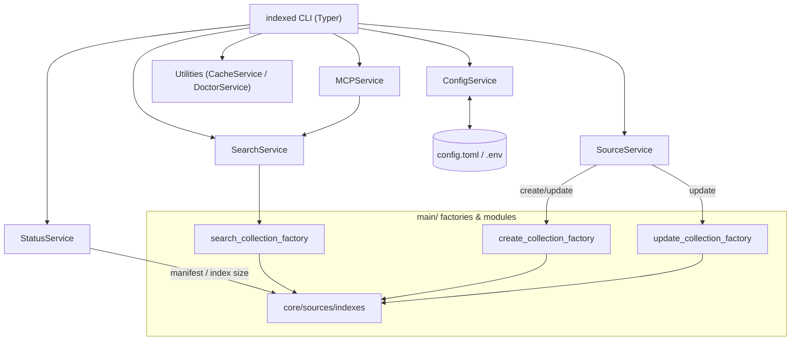
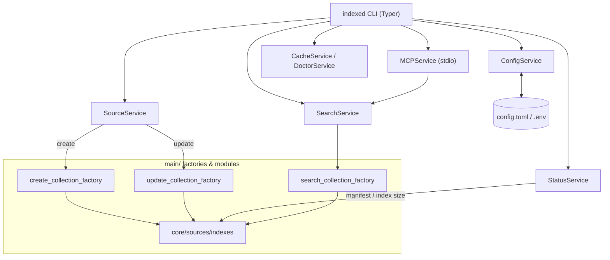
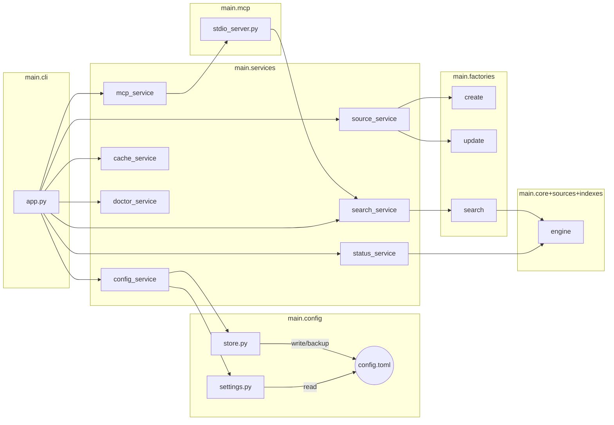

# Architecture Overview

## Core Modules
- `main/core`:
  - `DocumentCollectionCreator`: orchestrates read → convert → persist → index; writes manifest and mappings
  - `DocumentCollectionSearcher`: loads indexer; maps nearest neighbors back to documents and chunks
- `main/sources`:
  - Readers and converters for Jira, Confluence, and local files (Cloud and Server/DC variants)
  - `document_cache_reader_decorator.py` adds on-disk caching for repeated creation runs
- `main/indexes`:
  - `FaissIndexer`: wraps FAISS `IndexIDMap(IndexFlatL2)`; add/remove/search; serialize/deserialize
  - `SentenceEmbedder`: wraps `SentenceTransformer`; exposes `embed` and dimension
  - `indexer_factory`: creates/loads indexers for predefined embedding models
- `main/persisters`:
  - `DiskPersister`: text/bin I/O, folder ops, existence checks, directory listing
- `main/factories`:
  - Wiring for creator, updater, and searcher (persister + indexers + reader/converter)

## CLI (Typer only)
- Single entrypoint `indexed` with subcommands:
  - `indexed init`
    - Guided setup; creates minimal `config.yaml` and optionally `.env`.
  - `indexed source add jira|confluence|folder`
    - Add a source entry to `config.yaml`; prompts for required fields (e.g., baseUrl/basePath, query, indexer).
  - `indexed source list`
    - List configured sources (name, type).
  - `indexed source show <name>`
    - Show full config for a source.
  - `indexed source update [<name>]`
    - Update all sources or a single source; if collection folder is missing, performs initial create.
  - `indexed source remove <name> [--purge-data]`
    - Remove from config; optionally delete on-disk collection data.
  - `indexed status [--sources <list>]`
    - Print per-collection status (docs, chunks, last update, indexers, index size if available).
  - `indexed manifest <name>`
    - Pretty-print the collection `manifest.json`.
  - `indexed search "<query>" [--sources <list>] [--max-chunks N] [--max-docs N] [--include-full-text]`
    - Run local test search; if no sources specified, search all configured collections and aggregate results.
  - `indexed indexers list`
    - List supported indexer identifiers and default.
  - `indexed cache clear [<name>]`
    - Clear reader cache under `./data/caches` globally or per source.
  - `indexed doctor`
    - Validate environment variables, connectivity to Jira/Confluence endpoints, and file-system permissions.
  - `indexed mcp [--sources <list>] [--index <name>] [--max-chunks N] [--max-docs N] [--include-full-text] [--config <path>]`
    - Start unified MCP stdio server; registers one tool per selected source and an optional aggregated `search_all`.
- Backwards-compatible adapter scripts remain usable.

## Configuration Management (pydantic-settings + TOML)
- Files and precedence (highest → lowest):
  - CLI init kwargs (Typer flags for ad‑hoc overrides)
  - Environment variables (loaded from `.env`)
  - User config TOML (e.g., `~/.config/indexed/config.toml`)
  - Project config TOML (`./config.toml`)
  - Built-in defaults
- Schema (typed via Pydantic):
  - `sources`: dict keyed by source name → `{ name, type: jira|jiraCloud|confluence|confluenceCloud|localFiles, baseUrl|basePath, query, indexer, includePatterns?, excludePatterns? }`
  - `defaults`: e.g., `{ indexer, maxChunks, maxDocs }`
  - `mcp`: e.g., `{ defaultSources, toolPrefix }`
- Secrets handling: keep tokens/emails/passwords in env vars only; never persist secrets in TOML.
- Persistence: CLI writes TOML via atomic save (temp file + `os.replace`), keeps `.bak` backup.
- Runtime overrides: flags override for the current invocation without persisting; persistence happens only on "add/remove" style commands.
- Optional: in long-running MCP, support config reload on SIGHUP or mtime change.

## Data Model on Disk (per collection)
- `manifest.json`: { collectionName, updatedTime, lastModifiedDocumentTime, numberOfDocuments, numberOfChunks, reader, indexers }
- `documents/<id>.json`: converted document with fields like:
  - `id`, `url`, `modifiedTime`, `text` (optional), `chunks` (list)
- `indexes/`:
  - `<indexerName>/indexer`: serialized FAISS index (pickled bytes)
  - `index_document_mapping.json`: index item id → { documentId, documentUrl, documentPath, chunkNumber }
  - `reverse_index_document_mapping.json`: documentId → [index item ids]
  - `index_info.json`: { lastIndexItemId }

## Flows
- Create: clean/create folder → read+convert → persist docs → batch embed+index chunks → persist index and mappings → write manifest
- Update: load manifest and mappings → compute update window → re-read+convert → remove old ids for updated docs → re-index → persist
- Search: embed query → FAISS nearest neighbors → map ids to documents/chunks → optional text/chunks inclusion; aggregate across sources when needed

## Indexers and Embeddings
- Predefined indexers map to embedding models:
  - all-MiniLM-L6-v2, all-mpnet-base-v2, multi-qa-distilbert-cos-v1
- Indexer naming: `indexer_FAISS_IndexFlatL2__embeddings_<model-id>`

## Error Handling & Contracts
- Creator UPDATE requires existing collection (create-on-missing behavior handled by CLI)
- Cloud readers require `ATLASSIAN_EMAIL` and `ATLASSIAN_TOKEN`
- Confluence/Jira Server/DC accept token or login+password

## MCP Integration
- Unified `indexed mcp` command runs stdio MCP; registers per-source tools and an optional `search_all` tool

## New Component: Config Injection Gateway

### Purpose
Provide a thin adapter to resolve, validate, and translate `IndexedSettings` into operation-specific argument DTOs for services. Centralizes precedence (CLI overrides > env/.env > TOML > defaults) and default derivation (limits, flags, default indexer), used by CLI and MCP.

### Module & API
- Module: `src/main/services/inject_config.py`
- Enum: `ConfigSlice` = { `SEARCH`, `CREATE`, `UPDATE`, `INSPECT`, `MCP_DEFAULTS` }
- Core function (single entry):
  - `resolve_and_extract(kind: ConfigSlice, *, profile: str | None, overrides: dict | None, target: str | None = None) -> tuple[IndexedSettings, Any]`
    - Loads validated `IndexedSettings` via `ConfigService.get(profile, overrides)`
    - Extracts and returns the slice required by the requested service as a typed DTO defined in that service module.
- Minimal context type used internally: `ConfigContext` = { `settings: IndexedSettings`, `profile: str | None` }

### DTOs defined by service modules
- `main/services/search_service.py`: define and export `SearchArgs` dataclass describing needed parameters for `search()`.
- `main/services/collection_service.py`: define and export `CreateArgs`, `UpdateArgs` dataclasses (e.g., `use_cache`, `force`, and list of `SourceConfig` as appropriate).
- `main/services/inspect_service.py`: define and export `InspectArgs` (e.g., `include_index_size`).
- `MCPDefaults` (either in `inject_config.py` or a small `models.py`) to carry defaults for MCP tool behavior; referenced by MCP only.

### Data Sources in Settings
- `settings.search`: defaults for `max_docs`, `max_chunks`, include flags
- `settings.index`: defaults for `default_indexer`
- `settings.mcp`: MCP-specific defaults that can override search defaults when serving MCP
- `settings.sources`: optional lookup to map a logical source name to a concrete `SourceConfig` (for create/update flows)

### Precedence Strategy
1) Call `ConfigService.get(profile, overrides)` to obtain validated `IndexedSettings`.
2) For operation args, merge in order: operation overrides (CLI/env) → settings.* defaults → hardcoded fallbacks.

### Usage Patterns
- CLI `search`: call `resolve_and_extract(SEARCH, profile, overrides)` to get `(settings, search_args)`; then call `SearchService.search(query, **search_args)`.
- MCP `search`/`search_collection`: call `resolve_and_extract(MCP_DEFAULTS, profile_from_env, overrides_from_env)` once or per-call; for `search_collection` also build a `SourceConfig` (manifest-derived or via default indexer).
- CLI `update`: call `resolve_and_extract(UPDATE, profile, overrides)` to obtain `UpdateArgs` (e.g., names → `SourceConfig` list with default indexer) and call `update()`.

### Rationale
Avoid decorators or global mutation; keep the gateway as a pure translator. This maintains KISS, prevents circular imports, and standardizes option derivation across entry points.

## System Structure and Components
- CLI Layer (Typer): `indexed` orchestrates commands
  - Uses Services (below) and the existing `main/` factories; does not modify `main/` code
- Services (new, thin wrappers around existing modules)
  - ConfigService: load (pydantic-settings), validate, save TOML (atomic), resolve precedence
  - SourceService: map source config → appropriate reader+converter and creator/updater via factories
  - StatusService: read manifests, load indexers for sizes, format status
  - SearchService: single-collection and aggregated multi-source search
  - MCPService: unified stdio server that registers tools per source using SearchService
  - CacheService: clear caches under `./data/caches`
  - DoctorService: check env vars, endpoints reachability, filesystem perms
- Adapters (existing root scripts): kept for backward compatibility; CLI reproduces their functionality

## Command → Service → Script/Factory mapping
- `indexed source add ...` → ConfigService (writes TOML); no `main/` calls
- `indexed source list/show/remove` → ConfigService
- `indexed source update [name]` → SourceService →
  - If collection missing: create via `create_collection_factory.create_collection_creator(...)`
  - Else: update via `update_collection_factory.create_collection_updater(...).run()`
- `indexed status` → StatusService (reads `manifest.json`; optional index size via `indexer_factory.load_indexer`)
- `indexed manifest <name>` → StatusService (pretty-print manifest)
- `indexed search` → SearchService → `search_collection_factory.create_collection_searcher(...)`
- `indexed indexers list` → simple static list from `main/indexes/indexer_factory.py`
- `indexed cache clear` → CacheService (delete `./data/caches` entries)
- `indexed doctor` → DoctorService (env presence; try lightweight HEAD/GET to baseUrl)
- `indexed mcp` → MCPService (wraps SearchService per source; similar to `collection_search_mcp_stdio_adapter.py` but multi-source)

## Capability status (exists vs to build)
- Exists
  - Create collection (Confluence/Jira/Files) via root adapters and `create_collection_factory`
  - Update existing collection via `collection_update_cmd_adapter.py` and `update_collection_factory`
  - Single collection search via `collection_search_cmd_adapter.py` and `search_collection_factory`
  - Single-collection MCP stdio adapter (`collection_search_mcp_stdio_adapter.py`)
  - Persistence, retries, batching, progress utilities
- To build (no changes under `main/` required)
  - Typer CLI (`indexed`) with all commands listed above
  - ConfigService with TOML + pydantic-settings, atomic writes, precedence
  - Create-on-missing behavior in `source update` orchestration
  - Aggregated multi-source search (fan-out + simple merge strategy)
  - Unified multi-source MCP server
  - Status/manifest/index-size CLI, cache clear, doctor

## System Chart (high-level)
```
+---------------------+
|      indexed CLI    |
|  (Typer commands)   |
+----------+----------+
           |
           v
+---------------------+      +------------------------------+
|    ConfigService    |<---->|     config.toml / .env       |
+----------+----------+      +------------------------------+
           |
   +-------+--------+-------------------+------------------+------------------+
   |                |                   |                  |                  |
   v                v                   v                  v                  v
+------+        +--------+        +-----------+      +-----------+      +-----------+
|Source|        | Status |        |  Search   |      |   MCP     |      |  Utilities|
|Svc   |        |  Svc   |        |   Svc     |      |   Svc     |      | (Cache/Dr)|
+--+---+        +---+----+        +-----+-----+      +-----+-----+      +-----+-----+
   |                |                   |                  |                  |
   v                v                   v                  v                  v
       (factories & modules under main/)
   create/update → create_collection_factory / update_collection_factory → core/sources/indexes
   status/manifest → persister + manifest.json (+ load_indexer for size)
   search → search_collection_factory → core.searcher + indexers
   mcp → multi-source wrapper over SearchService
   cache/doctor → filesystem ops / HTTP pings
```

## System Chart (Mermaid)


## Implementation To-Dos and Changes

### New files to create
- `cli/indexed.py`
  - Typer CLI entrypoint; implements: init, source add/list/show/remove, source update, status, manifest, search, indexers list, cache clear, doctor, mcp.
- `settings.py`
  - pydantic-settings loader (TomlConfigSettingsSource + .env) with precedence: CLI > env/.env > user TOML > project TOML > defaults.
- `config_store.py`
  - Read/write TOML with atomic save (`os.replace`) and `.bak` backup; optional user path via platformdirs.
- `services/config_service.py`
  - Load/validate/merge config; mutate (add/list/show/remove); persist via `config_store` (no secrets in TOML).
- `services/source_service.py`
  - Create-on-missing vs update-existing orchestration; calls `main/factories` (create/update).
- `services/status_service.py`
  - Read manifests; compute index size via `main.indexes.indexer_factory.load_indexer` (optional).
- `services/search_service.py`
  - Single-collection and aggregated multi-source search using `main/factories/search_collection_factory`.
- `services/mcp_service.py`
  - Unified FastMCP stdio server; registers per-source tools and optional `search_all`.
- `services/cache_service.py`
  - Clear `./data/caches` globally or per source (compatible with cache decorator).
- `services/doctor_service.py`
  - Validate env vars per source type; lightweight HTTP checks to `baseUrl`; FS permissions checks.
- `examples/config.example.toml`
  - Example sources/defaults/mcp config for users.

### Files/services to update
- `pyproject.toml`
  - Add `[project.scripts] indexed = "cli.indexed:app"`
  - Add deps: `typer`, `pydantic-settings`, `platformdirs`, `tomli-w` (writer) if using TOML writes.
- `README.md`
  - Document new CLI workflow, config.toml example, `.env` usage, MCP `indexed mcp` snippet; keep legacy adapter docs.
- `.gitignore`
  - Ignore `config.toml`, `.env`, `.env.*`, keep `examples/config.example.toml`.
- Root adapters (optional):
  - Keep unchanged for back-compat; optionally add note pointing to `indexed`.

### Capability status recap
- Uses existing logic (no changes in `main/`): create/update/search flows via factories; FAISS/SBERT; persistence utils; single-collection MCP adapter.
- New layer to implement: CLI, config persistence, aggregated search, multi-source MCP, status/index-size, cache clear, doctor.

## FastAPI MCP Extension (optional)
- Goal: provide an HTTP-accessible MCP server and/or generate MCP tools from a FastAPI app while retaining the stdio server.
- Components to add:
  - `web/app.py`: FastAPI application exposing minimal endpoints (status, search, update) as needed
  - `mcp/fastapi_adapter.py` (or inline in CLI): build MCP via `FastMCP.from_fastapi(app=app)` and/or mount `mcp.http_app()` into FastAPI
- Modes supported (choose one or both):
  - Generate MCP from FastAPI: expose selected routes as MCP tools; hand-curate tools for best LLM UX
  - Mount MCP into FastAPI: serve MCP at `/mcp` alongside your REST API
- Key tasks:
  - Define FastAPI endpoints and explicit `operation_id`s for stable, friendly tool names
  - Generate MCP server: `mcp = FastMCP.from_fastapi(app=app)`; optionally register extra hand-crafted tools
  - Mounting option: `mcp_app = mcp.http_app(path='/mcp')`; pass lifespan to FastAPI and/or combine lifespans if needed
  - CLI: add `indexed serve-http` (run FastAPI with mounted MCP) and `indexed mcp-from-fastapi` (spawn generated MCP only)
  - Consider enabling new OpenAPI parser: set `FASTMCP_EXPERIMENTAL_ENABLE_NEW_OPENAPI_PARSER=true`
- Considerations (from FastMCP FastAPI integration):
  - Prefer curated tools over auto-conversion for complex APIs
  - Provide lifespan management correctly when mounting
  - Keep tool parameters simple; performance: in-memory client for tests
- Reference: FastMCP FastAPI integration docs: [FastAPI 🤝 FastMCP](https://gofastmcp.com/integrations/fastapi)

## Project layout (CLI + MCP only)
```
src/main/
  core/                 # unchanged
  sources/              # unchanged
  indexes/              # unchanged
  persisters/           # unchanged
  utils/                # unchanged
  cli/
    __init__.py
    app.py              # Typer entrypoint: `indexed`
  config/
    __init__.py
    settings.py         # pydantic-settings (TOML + .env; precedence)
    store.py            # atomic read/write of config.toml
  services/
    __init__.py
    config_service.py   # load/validate/merge/persist config (no secrets)
    source_service.py   # create-on-missing + update via main.factories
    status_service.py   # read manifest; optional index size via indexer_factory
    search_service.py   # single + aggregated multi-source search
    mcp_service.py      # unified FastMCP stdio server (multi-source)
    cache_service.py    # clear ./data/caches
    doctor_service.py   # env/baseUrl/FS checks
  mcp/
    __init__.py
    stdio_server.py     # thin FastMCP bootstrap used by mcp_service
```

## System Chart (Mermaid) – CLI + MCP only


## Module Interaction (Mermaid) – Packages

