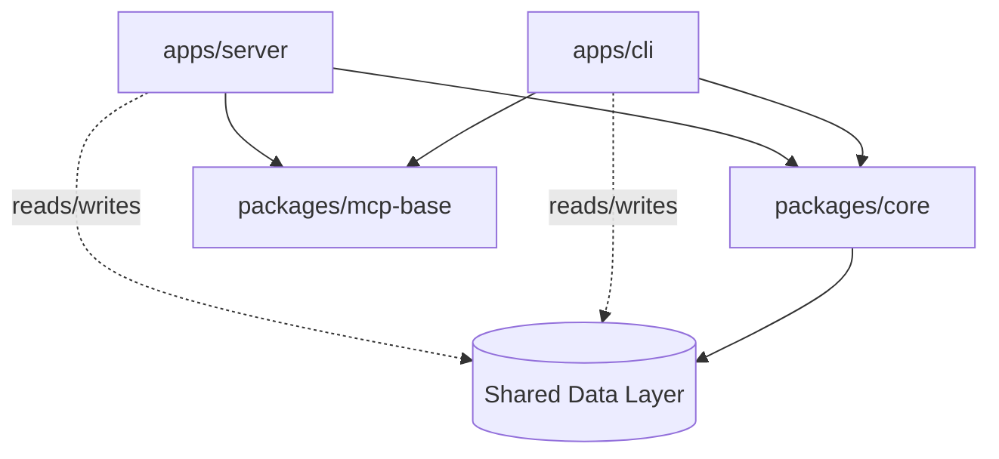
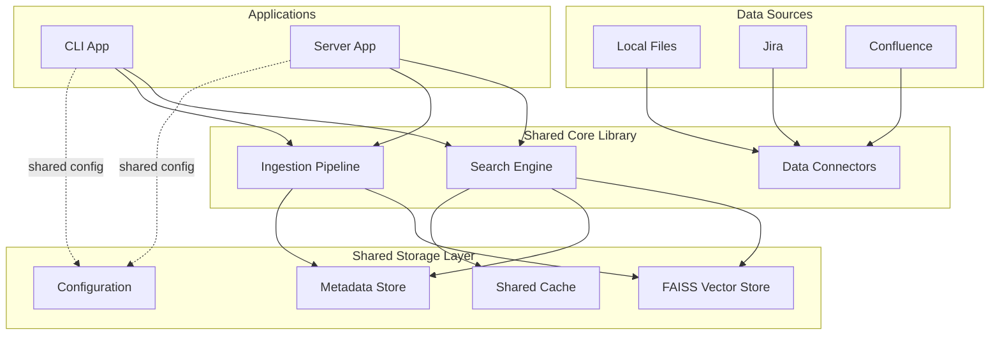
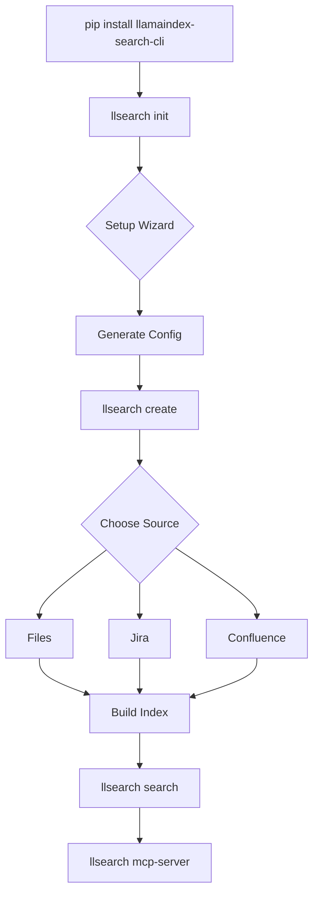
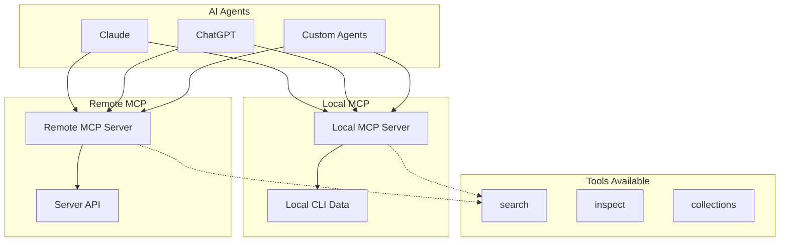
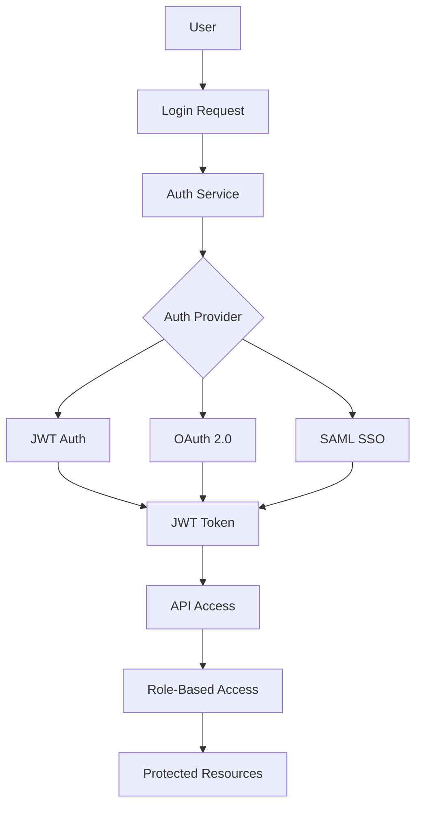

# Architecture & Code Structure

## Monorepo Architecture Overview

### 🏗️ Extensible Monorepo Design

The system uses a monorepo structure designed for future extension, but we implement CLI first:

```
indexed-python/
├── packages/
│   └── core/                    # 📦 indexed-core (shared library)
├── apps/
│   ├── cli/                     # 🖥️ indexed-cli (IMPLEMENT FIRST)
│   └── server/                  # 🌐 Future: indexed-server
├── tests/                       # 🧪 Test suite
├── docs/                        # 📚 Documentation
└── examples/                    # 📁 Usage examples
```

**Implementation Priority:**
1. **Phase 1 (MVP)**: `packages/core` + `apps/cli` - Get CLI working
2. **Phase 2 (Future)**: `apps/server` - Add web UI and API when needed

### 🏗️ Application-Library Architecture



**Architecture Rules**:
- **Applications** (CLI, Server) depend on shared libraries (Core, MCP-Base)
- **Shared Libraries** have no dependencies on applications
- **Both applications** access the same data layer (vector stores, metadata)
- **No cross-dependencies** between applications
- **Clean interfaces** between applications and libraries

## Core Shared Library Architecture

### 🧠 Core Engine Library Structure

```
packages/core/
├── __init__.py                  # Public API exports
├── ingestion/                   # Document processing pipeline
│   ├── pipeline.py             # LlamaIndex IngestionPipeline wrapper
│   ├── processors.py           # Document processors and transformations
│   ├── extractors.py           # Metadata and content extractors
│   └── validators.py           # Input validation and sanitization
├── storage/                     # Vector and metadata storage
│   ├── faiss_store.py          # FAISS vector store implementation
│   ├── metadata_store.py       # Document metadata persistence
│   ├── backup.py               # Backup and restore functionality
│   └── migrations.py           # Schema migration utilities
├── search/                      # Search orchestration
│   ├── engine.py               # Search engine coordination
│   ├── ranking.py              # Result ranking and scoring
│   ├── filters.py              # Search filtering logic
│   ├── aggregator.py           # Multi-collection search
│   └── cache.py                # Search result caching
├── connectors/                  # Data source integrations
│   ├── base.py                 # Base connector interface
│   ├── jira.py                 # Jira Cloud/Server integration
│   ├── confluence.py           # Confluence Cloud/Server
│   ├── files.py                # Local file processing
│   └── factory.py              # Connector factory pattern
├── config/                      # Configuration management
│   ├── settings.py             # Pydantic settings models
│   ├── validation.py           # Configuration validation
│   └── loader.py               # Configuration loading logic
└── utils/                       # Shared utilities
    ├── logging.py              # Structured logging setup
    ├── async_utils.py          # Async helper functions
    ├── metrics.py              # Performance metrics
    └── exceptions.py           # Custom exception classes
```

### 🔍 Shared Data Layer Architecture



## CLI Application Architecture

### 🖥️ CLI Application Structure

```
apps/cli/
├── __init__.py
├── main.py                      # Typer app entry point
├── commands/                    # Command implementations
│   ├── init.py                 # Interactive setup wizard
│   ├── create.py               # Collection creation commands
│   ├── search.py               # Search commands
│   ├── status.py               # Status and inspection
│   ├── config.py               # Configuration management
│   └── mcp_server.py           # Local MCP server command
├── ui/                          # Rich UI components
│   ├── progress.py             # Progress bars and indicators
│   ├── tables.py               # Data table formatting
│   ├── prompts.py              # Interactive prompts
│   ├── themes.py               # Color themes and styles
│   └── widgets.py              # Custom UI widgets
├── local/                       # Local storage management
│   ├── storage.py              # Local data directory management
│   ├── cache.py                # Local caching layer
│   └── config.py               # Local configuration handling
└── utils/
    ├── validation.py           # CLI input validation
    └── helpers.py              # CLI utility functions
```

### 🎮 CLI User Experience Flow



## Server Application Architecture

### ⚡ Server Application Structure

```
apps/server/
├── __init__.py
├── app.py                       # FastAPI application factory
├── api/                         # REST API endpoints
│   ├── v1/                     # API version 1
│   │   ├── collections.py      # Collection CRUD operations
│   │   ├── search.py           # Search endpoints
│   │   ├── users.py            # User management
│   │   ├── auth.py             # Authentication endpoints
│   │   └── admin.py            # Admin-only endpoints
│   └── middleware/             # API middleware
│       ├── auth.py             # Authentication middleware
│       ├── cors.py             # CORS handling
│       ├── rate_limit.py       # Rate limiting
│       └── logging.py          # Request logging
├── models/                      # Database models
│   ├── base.py                 # Base model classes
│   ├── user.py                 # User and team models
│   ├── collection.py           # Collection models
│   ├── search.py               # Search history models
│   └── audit.py                # Audit log models
├── auth/                        # Authentication system
│   ├── jwt.py                  # JWT token handling
│   ├── oauth.py                # OAuth provider integration
│   ├── permissions.py          # RBAC permission system
│   └── providers.py            # Auth provider abstractions
├── database/                    # Database management
│   ├── connection.py           # Database connection setup
│   ├── migrations/             # Alembic migration files
│   └── session.py              # Session management
├── services/                    # Business logic services
│   ├── collection_service.py   # Collection management logic
│   ├── search_service.py       # Search orchestration
│   ├── user_service.py         # User management logic
│   └── notification_service.py # Notification handling
└── utils/
    ├── background_tasks.py     # Async task management
    ├── websocket.py            # WebSocket connection handling
    └── health.py               # Health check endpoints
```

### 🌐 Server API Architecture

```mermaid
flowchart TD
    Client[Web Client] --> LB[Load Balancer]
    CLI[CLI Client] --> LB
    MCP[MCP Client] --> LB
    
    LB --> Auth[Auth Middleware]
    Auth --> API[FastAPI Router]
    
    API --> Collections[/api/v1/collections]
    API --> Search[/api/v1/search]
    API --> Users[/api/v1/users]
    API --> Admin[/api/v1/admin]
    
    Collections --> CollectionService[Collection Service]
    Search --> SearchService[Search Service]
    Users --> UserService[User Service]
    
    CollectionService --> Core[Core Engine]
    SearchService --> Core
    UserService --> DB[(PostgreSQL)]
    Core --> FAISS[(FAISS Index)]
```

## MCP Shared Library Architecture

### 🤖 MCP Base Library Structure

```
packages/mcp-base/
├── __init__.py
├── base.py                      # Base MCP server functionality
├── tools/                       # MCP tools (shared)
│   ├── search.py               # Search tool implementations
│   ├── inspect.py              # Document inspection tools
│   ├── collections.py          # Collection management tools
│   └── admin.py                # Administrative tools
├── local.py                     # Local MCP server implementation
├── remote.py                    # Remote MCP server implementation
├── resources/                   # MCP resources
│   ├── collections.py          # Collection resource providers
│   └── status.py               # Status resource providers
└── utils/
    ├── formatting.py           # Result formatting utilities
    ├── validation.py           # Input validation for tools
    └── auth.py                 # Authentication for remote MCP
```

### 🔄 MCP Integration Patterns



## Repository Infrastructure

### 🔧 Development Tooling

**Build System**:
```bash
# Multi-package build automation
tools/
├── build.py                     # Build all packages
├── release.py                   # Version management and release
├── test-all.py                  # Cross-package testing
├── lint-all.py                  # Code quality checks
└── dev-setup.py                 # Development environment setup
```

**GitHub Actions Workflows**:
```yaml
.github/workflows/
├── test.yml                     # Test matrix (Python versions, OSes)
├── build.yml                    # Build and package validation
├── release.yml                  # Automated PyPI releases
├── docker.yml                   # Container image builds
└── docs.yml                     # Documentation deployment
```

### 📦 Package Distribution

**PyPI Distribution Strategy**:
- **Synchronized versioning**: All packages share the same version number
- **Dependency management**: Clear dependency boundaries and version constraints
- **Release coordination**: Core package released first, others follow

**Installation Scenarios**:
```bash
# Individual developer
pip install llamaindex-search-cli

# Team deployment  
pip install llamaindex-search-server

# AI agent integration
pip install llamaindex-search-mcp-base

# Custom development
pip install llamaindex-search-core
```

### 🐳 Container Architecture

**Multi-stage Docker Builds**:
```dockerfile
# Base image with common dependencies
FROM python:3.11-slim as base
RUN pip install llamaindex-search-core

# CLI-specific image
FROM base as cli
RUN pip install llamaindex-search-cli
ENTRYPOINT ["llsearch"]

# Server-specific image  
FROM base as server
RUN pip install llamaindex-search-server
EXPOSE 8000
CMD ["llsearch-server"]
```

**Deployment Options**:
- **Single containers**: CLI, Server, MCP as separate containers
- **Docker Compose**: Multi-service development environment
- **Kubernetes**: Production-ready container orchestration

### 🔄 Data Architecture

**Local Storage (CLI)**:
```
~/.indexed/
├── config.toml                 # User configuration
└── data/                       # LlamaIndex native storage
    ├── sources/                # Source configurations
    └── collections/            # LlamaIndex collections (one per source)
```

**Server Storage (Future)**:
```
/var/lib/indexed/
├── collections/                # Shared collection data
├── uploads/                    # File upload staging
└── backups/                    # Automated backups

PostgreSQL Database:
├── users                       # User accounts and teams
├── collections                 # Collection metadata
├── search_history              # Search analytics
└── audit_logs                  # Compliance logging
```

### 🌐 Network Architecture

**Local Deployment**:
- CLI operates entirely offline
- Local MCP server uses stdio protocol
- No network dependencies for core functionality

**Server Deployment**:
- FastAPI server on configurable port (default 8000)
- PostgreSQL database connection
- Optional Redis for caching
- Static file serving for web interface

**Enterprise Deployment**:
- Load balancer (nginx/Traefik)
- Multiple server instances
- Database clustering
- Monitoring and observability stack

## Deployment Models

### 🏠 Local Development
```bash
# Development setup
git clone llamaindex-search
cd llamaindex-search
uv sync --dev

# Install packages in editable mode
uv pip install -e packages/core
uv pip install -e packages/cli
```

### 🏢 Production Server
```bash
# Docker Compose deployment
docker-compose up -d

# Kubernetes deployment
kubectl apply -f k8s/
```

### ☁️ Cloud Deployment
- **AWS**: ECS/EKS with RDS PostgreSQL
- **GCP**: Cloud Run with Cloud SQL
- **Azure**: Container Instances with Azure Database

## Security Architecture

### 🔐 Authentication Flow



### 🛡️ Data Security

- **Encryption at Rest**: AES-256 encryption for sensitive data
- **Encryption in Transit**: TLS 1.3 for all network communication
- **Key Management**: Environment variables, integration with secret stores
- **Access Control**: Role-based permissions with collection-level granularity

This architecture provides a solid foundation for building a scalable, maintainable document search platform that can grow from individual use to enterprise deployment while maintaining clean separation of concerns and excellent developer experience.