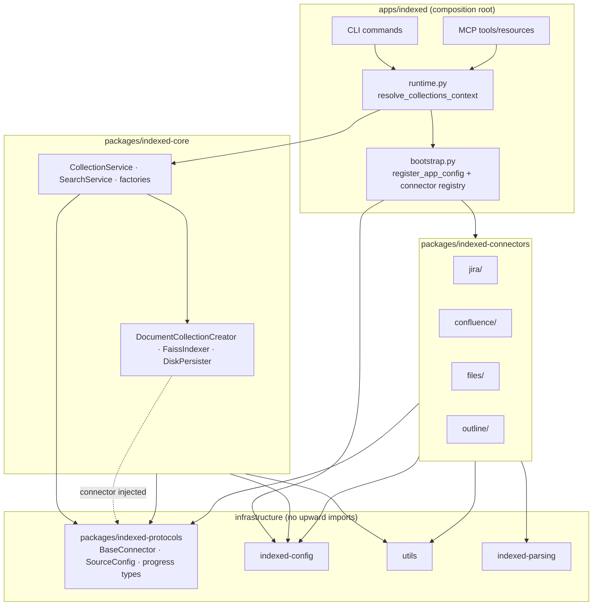

# Feature: architecture-audit — Architecture

Remediation blueprint for structural debt found in the 2026-06-29 monorepo audit.
Fixes dependency direction, config single-source, connector composition, and CLI/MCP
runtime parity **before** the v2 engine rewrite. Implementation follows
[plan.md](plan.md) units `architecture-audit/1`–`/12`.

**Parent:** [../../tech.md](../../tech.md)
**Requirements:** [product.md](product.md)
**Plan:** [plan.md](plan.md)
**Research:** [research/core.md](research/core.md) · [research/connectors.md](research/connectors.md) · [research/app.md](research/app.md) · [research/config.md](research/config.md) · [research/parsing-utils.md](research/parsing-utils.md) · [research/systemic.md](research/systemic.md)

---

## Target dependency graph



**Text summary (enforcement targets):**

| Layer | May import | Must NOT import |
|-------|-----------|-----------------|
| `apps/indexed` | core services, connectors (registry only), config, protocols, utils | — |
| `indexed-core` | `indexed-protocols`, `indexed-config`, `utils` | `indexed-connectors`, CLI, MCP |
| `indexed-connectors` | `indexed-protocols`, `indexed-config`, `utils`, `indexed-parsing` | core engine, CLI, MCP |
| `indexed-protocols` | stdlib, pydantic only | everything else |

**Concrete graph fixes:**

1. **New `packages/indexed-protocols/`** — owns shared contracts currently split across
   `core/v1/connectors/{base,metadata}.py` and `core/v1/engine/services/models.py`
   (`SourceConfig`, `ProgressUpdate`, `ProgressCallback`, `PhasedProgressCallback`).
2. **Remove `indexed-connectors` from `packages/indexed-core/pyproject.toml`** — today the
   declared dependency forces core to compile against concrete connectors; factories and
   `collection_service` already import them directly (audit critical violation).
3. **App composition root owns connector registry** — move discovery/build from
   `collection_service._build_connector_from_config` and import-time scans into
   `apps/indexed/src/indexed/bootstrap.py`; core receives a built `BaseConnector` or a
   `Callable[[SourceConfig], BaseConnector]` injected at call time.

<!-- merge -->
### indexed-protocols package decision

Extract a leaf workspace package `indexed-protocols` (Hatch wheel `src/protocols/`) so
protocols and DTOs are not owned by the engine package that consumes them.

**Move (re-export from old paths during transition, then delete shims):**

| Symbol | Current path | New path |
|--------|-------------|----------|
| `BaseConnector`, `DocumentReader`, `DocumentConverter` | `core/v1/connectors/base.py` | `protocols/connectors.py` |
| `ConnectorMetadata` | `core/v1/connectors/metadata.py` | `protocols/metadata.py` |
| `SourceConfig`, `ProgressUpdate`, `ProgressCallback`, `PhasedProgressCallback` | `core/v1/engine/services/models.py` | `protocols/models.py` |

**Dependencies:** `pydantic>=2`, no workspace deps. Every package that today imports
protocol types from `core` switches to `from protocols import …`.

**Rationale:** Breaks the cycle `core → connectors → core` at the type layer; enables
import-graph CI (unit `/12`) to fail on any `indexed-core → indexed-connectors` edge.
<!-- /merge -->

<!-- merge -->
### Dependency direction enforcement

After Phase 0:

- `uv run python -c "import core.v1"` must not import `connectors`.
- `indexed-core/pyproject.toml` lists only: `indexed-protocols`, `indexed-utils`,
  `faiss-cpu`, `sentence-transformers`, `onnxruntime`, `orjson`, `pydantic`.
- Connector construction happens exclusively in `apps/indexed` via
  `build_connector(cfg, config_service, registry)`.
- Core service signatures gain an optional `connector_factory` parameter; default
  `None` raises `ConfigurationError` with a message pointing callers to inject one
  (prevents silent regression to inline imports).

CI gate (unit `/12`): script walks `importlib` / static AST and asserts forbidden edges
(documented deny-list in `tests/system/test_import_graph.py`).
<!-- /merge -->

---

## Files

### New

```
packages/indexed-protocols/
  pyproject.toml
  src/protocols/
    __init__.py
    connectors.py          # BaseConnector, DocumentReader, DocumentConverter
    metadata.py            # ConnectorMetadata
    models.py              # SourceConfig, ProgressUpdate, ProgressCallback, PhasedProgressCallback

apps/indexed/src/indexed/
  bootstrap.py             # register_app_config(), build_connector_registry(), build_connector()
  runtime.py               # CliContext, resolve_collections_context()
```

Add `indexed-protocols` to root `pyproject.toml` workspace members and `apps/indexed`
dependencies (app must see connectors **and** protocols; core must not see connectors).

### Changed (high level)

| Path | Change |
|------|--------|
| `packages/indexed-core/pyproject.toml` | Remove `indexed-connectors` dep; add `indexed-protocols` |
| `packages/indexed-core/src/core/v1/__init__.py` | Delete import-time `ConfigService.register`; export version only |
| `packages/indexed-core/src/core/v1/engine/services/collection_service.py` | Remove `_build_connector_from_config`; accept injected connector or factory |
| `packages/indexed-core/src/core/v1/engine/factories/create_collection_factory.py` | Drop `connectors.document_cache_reader_decorator` top-level import; receive cache decorator via factory arg or app wiring |
| `packages/indexed-core/src/core/v1/engine/factories/update_collection_factory.py` | Same connector-factory injection as create path |
| `packages/indexed-core/src/core/v1/engine/services/models.py` | Re-export from `protocols` (temporary) then slim to engine-only DTOs (`CollectionStatus`, …) |
| `packages/indexed-core/src/core/v1/connectors/` | Re-export shims → delete after call sites migrated |
| `packages/indexed-config/src/indexed_config/store.py` | Deprecate merge `read()` for runtime paths; delegate to `read_for_mode` |
| `packages/indexed-config/src/indexed_config/service.py` | Honor `mode_override` on every `instance(mode=…)` call (no stale singleton) |
| `packages/indexed-connectors/src/connectors/*/__init__.py` | Remove import-time config registration; register via `bootstrap.register_app_config` |
| `packages/indexed-connectors/src/connectors/registry.py` | Align with app registry or delete if redundant |
| `packages/utils/src/utils/retry.py` | Add `TRANSIENT_HTTP_STATUS` + `is_transient_http_error()` |
| `apps/indexed/src/indexed/app.py` | Call `bootstrap.register_app_config` once in callback |
| `apps/indexed/src/indexed/mcp/tools.py` | Thread `collections_path` from `resolve_collections_context` |
| `apps/indexed/src/indexed/mcp/server.py` | Lifespan builds `CliContext`; attach to FastMCP state |
| `apps/indexed/src/indexed/knowledge/commands/*.py` | Replace `resolve_preferred_collections_path` heuristic with `resolve_collections_context` |
| `apps/indexed/src/indexed/utils/storage_info.py` | Delete `resolve_preferred_collections_path` after migration |
| `apps/indexed/src/indexed/connectors/__init__.py` | Narrow to registry helpers called from `bootstrap.py` (no import-time `_discover_connectors`) |

Optional consolidation: `packages/indexed-connectors/src/connectors/http.py` with
`request_with_retry()` wrapping `execute_with_retry` and shared transient-status filter
(readers import one helper instead of duplicating `(429, 500, 502, 503, 504)` tuples).

### Delete

| Path | Reason |
|------|--------|
| `packages/indexed-core/src/core/v1/engine/indexes/indexers/faiss_auto_indexer.py` | Speculative; never registered in `indexer_factory` production path |
| `packages/indexed-core/src/core/v1/engine/indexes/indexer_factory.py` references | Remove `FaissAutoIndexer` import branches |
| `JiraCloudConnector` / `ConfluenceCloudConnector` thin wrappers | Unified connectors (`JiraConnector`, `ConfluenceConnector`) already handle Cloud vs Server from URL |
| Legacy `SourceConfig.type` literals `jiraCloud`, `confluenceCloud` | Collapse to `jira`, `confluence` after migration window |
| Dead service DTOs flagged in [research/core.md](research/core.md) | Remove only after grep confirms zero callers |
| Duplicate connector builder in `update_collection_factory.py` (~L166 mirror comment) | Single `build_connector` in app layer |

<!-- merge -->
### App bootstrap pattern

`apps/indexed/src/indexed/bootstrap.py` is the **only** module that imports both
`connectors.*` and `core` service entry points for wiring.

```python
# apps/indexed/src/indexed/bootstrap.py
from indexed_config import ConfigService
from protocols import SourceConfig, BaseConnector

def register_app_config(config_service: ConfigService) -> None:
    """Register core + connector config specs — called once from app.py callback."""
    from core.v1.config_models import register_core_v1_specs  # new explicit fn
    from connectors.files.schema import FilesConfig
    # … one register() per spec, no try/except pass

    register_core_v1_specs(config_service)
    config_service.register(FilesConfig, path="sources.files")
    # jira, confluence, outline …

def build_connector_registry() -> dict[str, type]:
    """Explicit registry — wraps existing discovery, invoked at startup not import."""
    from indexed.connectors import get_connector_registry
    return get_connector_registry()

def build_connector(
    cfg: SourceConfig,
    config_service: ConfigService,
    registry: dict[str, type],
) -> BaseConnector:
    """Map SourceConfig.type → registry entry; call from_config() or ctor."""
    key = _normalize_type(cfg.type)  # jiraCloud → jira during migration
    cls = registry.get(key)
    if cls is None:
        raise ConfigurationError(f"Unknown connector type: {cfg.type}")
    _apply_source_config_to_service(cfg, config_service)
    return cls.from_config(config_service)
```

Call chain: `app.py` `@app.callback` → `register_app_config(ConfigService.instance())`.
MCP lifespan repeats the same call (idempotent register).
<!-- /merge -->

<!-- merge -->
### CLI/MCP runtime context

Replace ad-hoc path heuristics with one resolver used by CLI **and** MCP.

```python
# apps/indexed/src/indexed/runtime.py
from dataclasses import dataclass
from pathlib import Path

@dataclass(frozen=True)
class CliContext:
    mode: str                          # "global" | "local"
    collections_path: Path
    caches_path: Path
    config_service: ConfigService
    connector_registry: dict[str, type]

def resolve_collections_context(
    mode_override: str | None = None,
    *,
    workspace: Path | None = None,
) -> CliContext:
    """Single source for storage paths + config + registry."""
    config_service = ConfigService.instance(mode_override=mode_override)
    mode = config_service.resolve_storage_mode()
    resolver = config_service.resolver
    return CliContext(
        mode=mode,
        collections_path=resolver.get_collections_path(mode),
        caches_path=resolver.get_caches_path(mode),
        config_service=config_service,
        connector_registry=build_connector_registry(),
    )
```

**CLI:** read `mode_override` from `typer.Context.obj`; pass `ctx.collections_path`
into `svc_search(..., collections_path=str(ctx.collections_path))`.

**MCP:** build `CliContext` in server lifespan; tools read from `ctx.request_context.lifespan_state["cli_context"]`.

**Delete:** `resolve_preferred_collections_path()` — its “prefer local collections dir
if non-empty” rule contradicts [tech-config.md](../../tech-config.md) single-source mode
and caused search/inspect vs create path skew ([research/app.md](research/app.md)).
<!-- /merge -->

---

## Contract / API

| Function / type | Owner | Contract |
|-----------------|-------|----------|
| `resolve_collections_context(mode_override) -> CliContext` | `apps/indexed/runtime.py` | Resolves mode via `ConfigService`, paths via `StorageResolver`, registry via `build_connector_registry()`. Never merges global+local TOML. |
| `register_app_config(config_service) -> None` | `apps/indexed/bootstrap.py` | Idempotent explicit spec registration; raises on failure (no silent `except: pass`). |
| `build_connector(cfg, config_service, registry) -> BaseConnector` | `apps/indexed/bootstrap.py` | Only supported connector construction path for app layer. |
| `build_connector_registry() -> dict[str, type]` | `apps/indexed/bootstrap.py` | Compatible connectors only; keys match normalized `SourceConfig.type`. |
| `CollectionService.create(..., connector_factory=…)` | `indexed-core` | Factory callable `(SourceConfig) -> BaseConnector`; core never imports connectors. |
| `TRANSIENT_HTTP_STATUS` | `utils/retry.py` | `frozenset({429, 500, 502, 503, 504})` — shared by all connector HTTP readers. |
| `is_transient_http_error(exc) -> bool` | `utils/retry.py` | Reads `exc.status_code` or `exc.response.status_code`; used before retry/sleep. |

```python
# packages/utils/src/utils/retry.py
TRANSIENT_HTTP_STATUS: frozenset[int] = frozenset({429, 500, 502, 503, 504})

def is_transient_http_error(exc: BaseException) -> bool:
    status = getattr(exc, "status_code", None) or getattr(
        getattr(exc, "response", None), "status_code", None
    )
    return status in TRANSIENT_HTTP_STATUS
```

Connector readers (Jira, Confluence, Outline) replace inline status tuples with
`is_transient_http_error` + `execute_with_retry`.

---

## Implementation Detail

### Phase summary

| Phase | Units | Goal |
|-------|-------|------|
| **0 — Graph** | `/1`–`/4` | Extract `indexed-protocols`; sever `core→connectors` pyproject dep; app bootstrap + registry; unified `CliContext` for CLI+MCP |
| **1 — Hygiene** | `/5`–`/8` | Explicit config registration; `read_for_mode` only; shared HTTP retry constants; delete speculative/dead code |
| **2 — Services** | `/9`–`/11` | Remove `setup_root_logger()` at core import; delete `_build_connector_from_config`; `IndexedError` handlers in CLI/MCP |
| **3 — Validation** | `/12` | Import-graph CI test + characterization baseline so regressions fail PRs |
| **4 — App DRY (defer overlap)** | post-`/12` or issue #119 | Shared search facade, formatter extraction, command file size — tracked separately; not blocking graph fixes |

Execute phases in order; each phase must pass the verify gate before the next starts.

### Current violation hotspots

| Hotspot | Path | Problem | Fix |
|---------|------|---------|-----|
| Core builds connectors | `packages/indexed-core/src/core/v1/engine/services/collection_service.py` (`_build_connector_from_config`, ~L22–110) | Imports `connectors.jira`, `connectors.confluence`, `connectors.files` inside core | Delete function; callers pass `build_connector(...)` result or factory from app |
| Import-time config registration | `packages/indexed-core/src/core/v1/__init__.py` (~L16–33) | `ConfigService.instance()` + `register()` on import; violates [tech.md](../../tech.md) § Config Registration | Move to `register_core_v1_specs()` called from `bootstrap.register_app_config` |
| TOML merge path | `packages/indexed-config/src/indexed_config/store.py` `read()` (~L140–172) | Still `deep_merge(global, workspace)` when `mode_override` unset; contradicts single-source spec | Runtime code paths switch to `read_for_mode(resolved_mode)`; `read()` retained temporarily for `config set` tooling only |
| MCP missing storage context | `apps/indexed/src/indexed/mcp/tools.py` (~L39–48, ~L74–80) | `svc_search` / `svc_status` called with `collections_path=None` → core falls back to `get_default_collections_path()` | Inject `str(cli_context.collections_path)` from lifespan state |
| Factory connector imports | `create_collection_factory.py`, `update_collection_factory.py` | Top-level / lazy imports from `connectors` | Accept reader/converter from injected connector; cache decorator wired in app |
| Duplicate registry logic | `apps/indexed/connectors/__init__.py` + core builder | Two ways to resolve type→class | Single registry in `bootstrap.py` |
| Import-time connector config | `packages/indexed-connectors/src/connectors/jira/__init__.py` (and confluence, files, outline) | Same anti-pattern as core `__init__` | Register in `bootstrap.register_app_config` |
| Import-time logging | `collection_service.py` (~L19) | `setup_root_logger()` at module import | Remove; app callback owns logging bootstrap |

### Data flow (after remediation)

```text
CLI/MCP entry
  → resolve_collections_context(mode_override)
       → ConfigService.instance(mode_override)
       → StorageResolver.get_collections_path(mode)
       → build_connector_registry()
  → bootstrap.build_connector(source_config, config_service, registry)
       → BaseConnector instance
  → core.collection_service.create(..., connector=connector, collections_path=ctx.collections_path)
       → DocumentCollectionCreator (reader/converter from connector)
       → FaissIndexer → DiskPersister
```

Search/update/inspect/status paths follow the same `CliContext.collections_path` threading;
MCP and CLI differ only in output formatting, not storage resolution.

### Migration notes

- **Re-export window:** Keep `from core.v1.engine.services import SourceConfig` as a
  deprecated re-export for one release; update tests and app code first.
- **`SourceConfig.type` literals:** Accept legacy `jiraCloud`/`confluenceCloud` in
  `_normalize_type()`; emit deprecation warning; remove in v2 feature.
- **Tests:** Move `tests/unit/indexed/services/test_collection_service.py` connector
  patches to `tests/unit/indexed/test_bootstrap.py`; core tests inject mock connectors
  without patching `connectors.*` module paths.
- **Workspace:** Add `indexed-protocols` to `uv.lock` in the same commit as `/1`.
