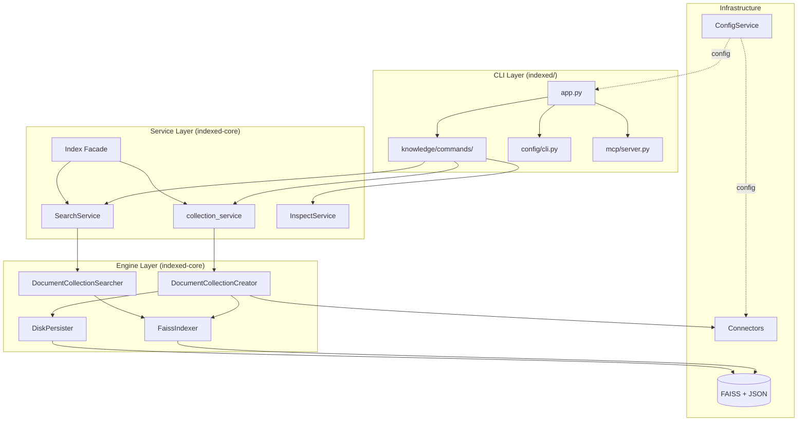
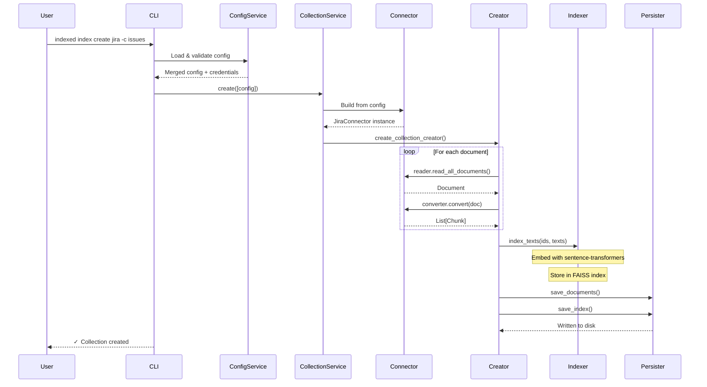
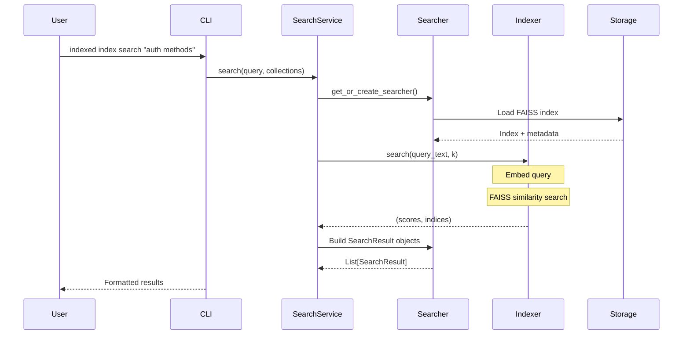

# System Architecture

Indexed follows a layered architecture with clear separation of concerns. This document covers the overall system design, data flow patterns, and storage organization.

## High-Level Overview

The system is organized into three primary layers:



## Layer Responsibilities

### CLI Layer (`indexed/src/indexed/`)

The user interface layer handles command parsing, output formatting, and user interactions.

| Component | Responsibility |
|-----------|---------------|
| `app.py` | Main Typer application, global flags, logging setup |
| `knowledge/commands/` | Index operations: create, search, inspect, update, remove |
| `config/cli.py` | Configuration management commands |
| `mcp/server.py` | FastMCP server for AI agent integration |
| `utils/` | Rich UI components, progress bars, theming |

### Service Layer (`packages/indexed-core/`)

Business logic and orchestration of core operations.

| Component | Type | Responsibility |
|-----------|------|---------------|
| `collection_service` | Functions | `create()`, `update()`, `clear()` operations |
| `SearchService` | Class | Semantic search with cached searchers |
| `InspectService` | Class | Collection status and metadata inspection |
| `Index` | Facade | High-level API for library users |

### Infrastructure Layer

Low-level components for data access and storage.

| Component | Package | Responsibility |
|-----------|---------|---------------|
| `ConfigService` | indexed-config | TOML config loading, validation, merging |
| `Connectors` | indexed-connectors | Document reading from Jira, Confluence, files |
| `FaissIndexer` | indexed-core | Vector embedding and similarity search |
| `DiskPersister` | indexed-core | Collection storage to disk |

## Data Flow: Indexing Pipeline

When a user creates a new collection, data flows through several stages:



### Indexing Steps

1. **Config Resolution** - Load TOML config, merge with env vars, validate with Pydantic
2. **Connector Creation** - Build appropriate connector (Jira, Confluence, Files) from config
3. **Document Reading** - Connector's reader fetches documents from source
4. **Document Conversion** - Connector's converter chunks documents into searchable segments
5. **Embedding Generation** - FaissIndexer generates vector embeddings via sentence-transformers
6. **FAISS Indexing** - Vectors stored in FAISS IndexFlatL2 for similarity search
7. **Persistence** - Documents, metadata, and index saved to disk

## Data Flow: Search Pipeline



### Search Steps

1. **Query Parsing** - Extract query and target collections
2. **Searcher Retrieval** - Get or create cached searcher for collection
3. **Query Embedding** - Generate vector embedding for query text
4. **Similarity Search** - FAISS finds k-nearest neighbors
5. **Result Building** - Map indices back to document chunks
6. **Formatting** - Rich output with scores and metadata

## Storage Architecture

Collections are stored in a structured directory hierarchy:

```
~/.indexed/                          # Global storage root
├── config.toml                      # Global configuration
├── .env                             # Sensitive credentials
└── data/
    └── collections/
        └── {collection_name}/
            ├── manifest.json        # Collection metadata
            ├── documents/           # Document metadata
            │   ├── doc_001.json
            │   └── doc_002.json
            └── indexes/
                ├── index_info.json
                ├── index_document_mapping.json
                └── indexer_FAISS_*/
                    └── indexer      # FAISS binary index
```

### Storage Modes

Indexed supports two storage modes:

| Mode | Location | Use Case |
|------|----------|----------|
| **Global** | `~/.indexed/` | Shared across all projects (default) |
| **Local** | `./.indexed/` | Project-specific collections |

Use `--local` or `--global` flags to override, or set `storage.mode` in config.

### File Formats

**manifest.json** - Collection metadata:
```json
{
  "name": "jira-issues",
  "connector_type": "jira",
  "created_at": "2024-01-15T10:30:00Z",
  "document_count": 145,
  "indexers": ["indexer_FAISS_IndexFlatL2__embeddings_all-MiniLM-L6-v2"]
}
```

**index_info.json** - Index configuration:
```json
{
  "indexer_type": "FAISS_IndexFlatL2",
  "embedding_model": "all-MiniLM-L6-v2",
  "dimension": 384,
  "chunk_count": 892
}
```

## Design Patterns

### Facade Pattern

The `Index` class provides a simplified API that wraps the service layer:

```python
from core.v1 import Index

index = Index()
index.add_collection("docs", connector)
results = index.search("query")
status = index.status()
```

This pattern enables both CLI usage (direct service calls) and library usage (via Index facade).

### Protocol-Based Extensibility

Connectors implement the `BaseConnector` protocol, enabling plugin-style extensions:

```python
@runtime_checkable
class BaseConnector(Protocol):
    @property
    def reader(self): ...

    @property
    def converter(self): ...

    @property
    def connector_type(self) -> str: ...
```

New data sources can be added without modifying core code.

### Configuration-Driven Behavior

All behavior is controlled by configuration files, not hardcoded values:

- TOML files define settings
- Pydantic models validate configuration
- Environment variables override for secrets
- Hierarchical merging (global → workspace → env)

## Performance Considerations

| Aspect | Strategy |
|--------|----------|
| **Embedding** | Batch processing, cached model loading |
| **Search** | Cached searcher instances per collection |
| **Storage** | Memory-mapped FAISS indexes |
| **I/O** | Lazy loading of indexes on demand |

Current scale targets: Up to 100K documents per collection on a single machine.
