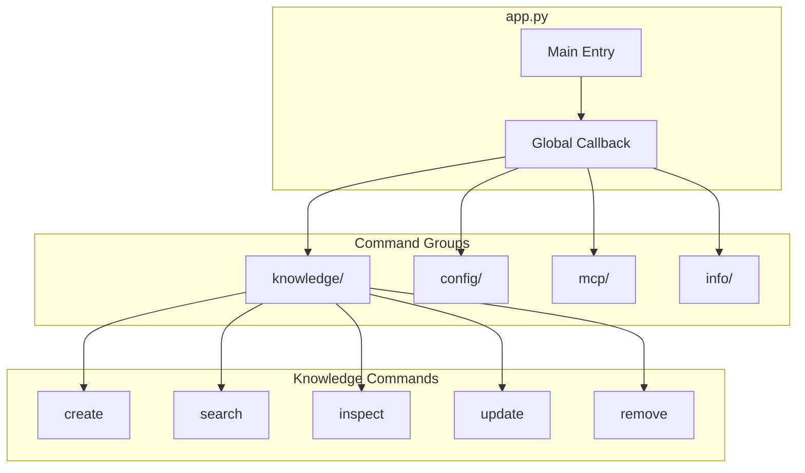
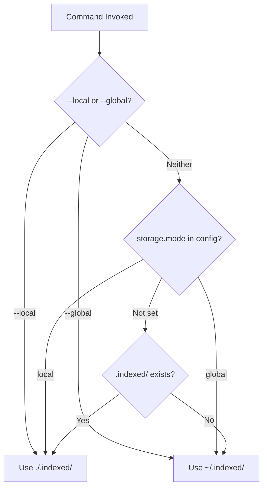

# CLI Design

The Indexed CLI is built with Typer and Rich, providing a polished terminal experience with consistent styling and clear feedback.

## Command Architecture



## Entry Point Structure

```python
# indexed/src/indexed/app.py

app = typer.Typer(
    add_completion=True,
    help="Index Institutional Knowledge and Make it Available for AI Agents!",
    rich_markup_mode="rich",
    pretty_exceptions_enable=True,
)

@app.callback(invoke_without_command=True)
def _init_app(
    ctx: typer.Context,
    verbose: bool = typer.Option(False, "--verbose", help="Enable INFO logging"),
    log_level: str = typer.Option(None, "--log-level", help="Set log level"),
    json_logs: bool = typer.Option(False, "--json-logs", help="JSON log format"),
) -> None:
    """Initialize logging and storage mode."""
    setup_root_logger(level_str=log_level or ("INFO" if verbose else None))
    
    # Resolve storage mode
    config_service = ConfigService.instance(
        workspace=Path.cwd(),
        mode_override=mode_override,
    )
    ctx.obj = {"config_service": config_service}
```

## Command Organization

### Flat Command Structure

Commands appear flat in help but are organized in subdirectories:

```bash
indexed --help

Commands:
  index create    Create New Collections using Connectors
  index search    Search one or all Collections
  index inspect   Inspect Collections
  index update    Update a Collection
  index remove    Remove one or more Collections
  
  config inspect  Inspect Configuration Settings
  config set      Set Configuration Values
  config validate Validate Configuration
  
  mcp run         Run The MCP Server
  mcp dev         Run MCP Server In Development Mode
```

### Command Registration Pattern

```python
# Register grouped commands as flat
app.command("index create", rich_help_panel="Knowledge Management")(
    knowledge.create.create_command
)
app.command("index search", rich_help_panel="Knowledge Management")(
    knowledge.search.search
)

# Hide the group itself
app.add_typer(
    knowledge.app,
    name="knowledge",
    hidden=True,
)
```

## Storage Mode Handling

### Global Flags

Storage mode is resolved early via global flags:

```python
def _parse_early_storage_flags() -> tuple[bool, bool]:
    """Parse --local and --global flags from sys.argv early."""
    use_local = "--local" in sys.argv
    use_global = "--global" in sys.argv
    
    # Remove flags from argv so Typer doesn't complain
    sys.argv = [a for a in sys.argv if a not in ("--local", "--global")]
    
    return use_local, use_global
```

### Storage Mode Resolution



### Storage Info Display

```python
def print_storage_info(
    console: Console,
    mode: StorageMode,
    path: Path,
    reason: str,
) -> None:
    """Display storage mode indicator."""
    icon = "📁" if mode == "local" else "🌐"
    console.print(f"{icon} Using {mode} storage: {path}")
    console.print(f"   ({reason})", style="dim")
```

Output example:
```
🌐 Using global storage: ~/.indexed/
   (default - no local .indexed/ found)
```

## Rich UI Components

### Theme System

```python
# indexed/src/indexed/utils/components/theme.py

ACCENT_COLOR = "#00D4AA"  # Teal accent

def get_help_theme_styles() -> dict:
    """Get Rich theme styles for help display."""
    return {
        "option": f"bold {ACCENT_COLOR}",
        "switch": f"bold {ACCENT_COLOR}",
        "command": f"bold {ACCENT_COLOR}",
    }
```

### Panel Components

```python
# indexed/src/indexed/utils/components/cards.py

def info_card(
    title: str,
    content: str,
    subtitle: str = None,
) -> Panel:
    """Create styled info card."""
    return Panel(
        content,
        title=f"[bold]{title}[/bold]",
        subtitle=f"[dim]{subtitle}[/dim]" if subtitle else None,
        border_style="dim",
        box=box.ROUNDED,
        padding=(1, 2),
    )
```

### Status Indicators

```python
# indexed/src/indexed/utils/components/status.py

def success(message: str) -> str:
    return f"[green]✓[/green] {message}"

def error(message: str) -> str:
    return f"[red]✗[/red] {message}"

def warning(message: str) -> str:
    return f"[yellow]![/yellow] {message}"

def info(message: str) -> str:
    return f"[blue]ℹ[/blue] {message}"
```

### Progress Bars

```python
# indexed/src/indexed/utils/progress_bar.py

def create_progress() -> Progress:
    """Create styled progress bar."""
    return Progress(
        SpinnerColumn(),
        TextColumn("[progress.description]{task.description}"),
        BarColumn(),
        TaskProgressColumn(),
        TimeElapsedColumn(),
        console=Console(),
    )

# Usage
with create_progress() as progress:
    task = progress.add_task("Indexing...", total=100)
    for i in range(100):
        progress.update(task, advance=1)
```

## Logging Strategy

### Three Log Levels

| Mode | Flag | Level | Output |
|------|------|-------|--------|
| Default | (none) | WARNING | Clean, errors only |
| Verbose | `--verbose` | INFO | Operation progress |
| Debug | `--log-level=DEBUG` | DEBUG | Full debugging info |

### Logging Setup

```python
# indexed/src/indexed/utils/logging.py

def setup_root_logger(
    level_str: str = None,
    json_mode: bool = False,
) -> None:
    """Configure Loguru root logger."""
    from loguru import logger
    
    # Remove default handler
    logger.remove()
    
    # Determine level
    level = level_str.upper() if level_str else "WARNING"
    
    # Add handler with appropriate format
    if json_mode:
        logger.add(sys.stderr, format="{message}", serialize=True, level=level)
    else:
        logger.add(
            sys.stderr,
            format="<level>{level: <8}</level> | {message}",
            level=level,
            colorize=True,
        )
```

### Log Message Guidelines

```python
# ✅ Good - user-friendly, contextual
logger.info(f"Found {len(collections)} collections: {', '.join(names)}")
logger.info(f'Searching "{query}" across {len(configs)} collections')
logger.info(f"✓ {collection}: {count} documents indexed")

# ❌ Bad - too technical, no context
logger.info("Starting search operation")
logger.debug(f"Config object: {config}")
```

## Command Patterns

### Create Command Pattern

```python
# indexed/src/indexed/knowledge/commands/create.py

@app.command("jira")
def create_jira(
    collection: str = typer.Option(..., "-c", "--collection", help="Collection name"),
    url: str = typer.Option(None, "--url", help="Jira URL"),
    jql: str = typer.Option(None, "--jql", help="JQL query"),
) -> None:
    """Create a Jira collection."""
    config = typer.Context.obj["config_service"]
    
    # Override config with CLI args
    if url:
        config.set("sources.jira.url", url)
    if jql:
        config.set("sources.jira.query", jql)
    
    # Validate requirements
    validation = config.validate_requirements(
        config_class=JiraCloudConfig,
        namespace="sources.jira",
        cli_overrides={"url": url, "jql": jql},
    )
    
    if validation["missing"]:
        # Prompt for missing values
        for field in validation["missing"]:
            value = typer.prompt(f"Enter {field}")
            config.set_value(f"sources.jira.{field}", value)
    
    # Create collection
    connector = JiraCloudConnector.from_config(config)
    with create_progress() as progress:
        task = progress.add_task("Indexing...", total=None)
        svc_create([SourceConfig(name=collection, ...)], config_service=config)
    
    console.print(success(f"Collection '{collection}' created"))
```

### Search Command Pattern

```python
# indexed/src/indexed/knowledge/commands/search.py

@app.command()
def search(
    query: str = typer.Argument(..., help="Search query"),
    collection: str = typer.Option(None, "-c", "--collection"),
    limit: int = typer.Option(10, "-l", "--limit"),
    json_output: bool = typer.Option(False, "--json"),
) -> None:
    """Search indexed collections."""
    results = svc_search(query, configs=configs, max_docs=limit)
    
    if json_output:
        console.print_json(data=results)
    else:
        for coll_name, coll_results in results.items():
            console.print(f"\n[bold]{coll_name}[/bold]")
            for result in coll_results:
                console.print(info_card(
                    title=result.chunk_id,
                    content=result.text[:200] + "...",
                    subtitle=f"Score: {result.score:.2f}",
                ))
```

## Error Handling

### Typer Exit Codes

```python
# Clean exit
raise typer.Exit(0)

# Error exit
console.print(error("Collection not found"))
raise typer.Exit(1)

# Abort (Ctrl+C handling)
raise typer.Abort()
```

### Exception Handling Pattern

```python
@app.command()
def some_command():
    try:
        # Operation
        result = do_something()
    except ConfigurationError as e:
        console.print(error(f"Configuration error: {e}"))
        raise typer.Exit(1)
    except ConnectorError as e:
        console.print(error(f"Connector error: {e}"))
        console.print("[dim]Check your credentials and try again[/dim]")
        raise typer.Exit(1)
    except Exception as e:
        logger.exception("Unexpected error")
        console.print(error(f"Unexpected error: {e}"))
        raise typer.Exit(1)
```

## MCP Server Integration

```python
# indexed/src/indexed/mcp/server.py

from fastmcp import FastMCP

mcp = FastMCP("indexed")

@mcp.tool()
def search(query: str, collection: str = None) -> dict:
    """Search indexed documents."""
    return svc_search(query, collection=collection)

@mcp.tool()
def list_collections() -> list:
    """List available collections."""
    return [s.name for s in svc_status()]

def main():
    mcp.run()
```

### MCP CLI Commands

```bash
# Run MCP server
indexed mcp run

# Development mode with inspector
indexed mcp dev

# Inspect server capabilities
indexed mcp inspect
```

## Best Practices

### Command Design

1. **Use clear option names** - `--collection`, not `-c` alone
2. **Provide sensible defaults** - `--limit 10`
3. **Support JSON output** - `--json` for scripting
4. **Show progress** - Use spinners/progress bars for long ops
5. **Confirm destructive actions** - `--yes` to skip

### UI Guidelines

1. **Minimal color** - Bold for emphasis, dim for secondary
2. **Clear hierarchy** - Panels, sections, consistent spacing
3. **Actionable feedback** - What happened, what to do next
4. **Error context** - Include solution hints

### Logging Best Practices

1. **Default is quiet** - Only warnings/errors by default
2. **Verbose shows progress** - What's happening step by step
3. **Debug for developers** - Technical details, timings
4. **No print statements** - Always use logger or Rich console


