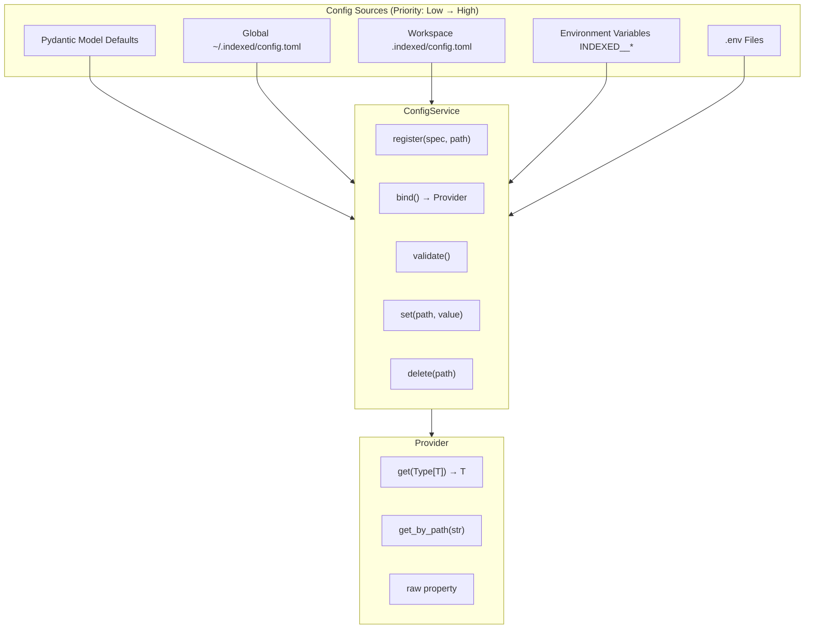
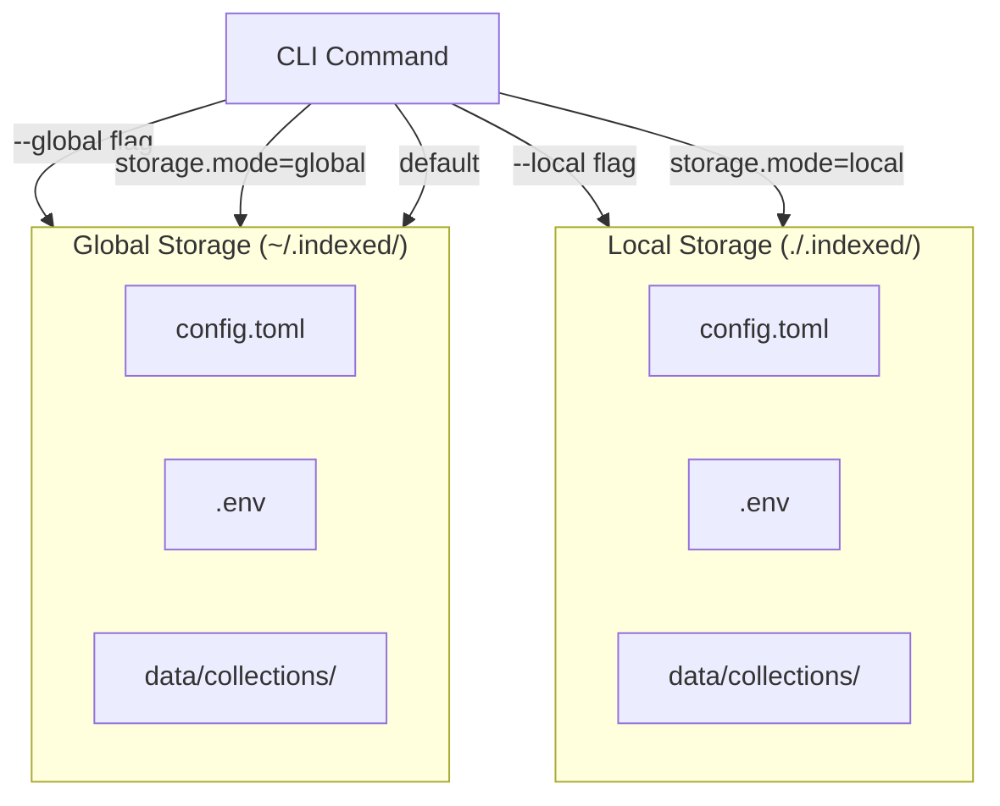

# Configuration System

The `indexed-config` package provides a unified configuration system built on explicit registration, Pydantic validation, and automatic secret handling.

## Design Principles

| Principle | Description |
|-----------|-------------|
| **Single Source of Truth** | `indexed-config` is THE config system |
| **Explicit Registration** | Components register their config specs at usage point |
| **Zero Coupling** | ConfigService doesn't know about consumers |
| **Type Safety** | Pydantic validation throughout |
| **Version Awareness** | Namespaced paths support `core.v1.*`, `core.v2.*`, etc. |

## Architecture Overview



## Config Priority Hierarchy

Configuration values are merged in order of increasing priority:


| Source | Location | Priority |
|--------|----------|----------|
| Pydantic defaults | Model definition | Lowest |
| Global config | `~/.indexed/config.toml` | Low |
| Workspace config | `./.indexed/config.toml` | Medium |
| Environment variables | `INDEXED__section__key=value` | Highest |

## ConfigService API

### Core Methods

```python
from indexed_config import ConfigService

# Initialize (singleton pattern)
config = ConfigService()
# OR
config = ConfigService.instance()
```

#### `register(spec, path)`

Register a Pydantic model at a dot-path:

```python
from connectors.jira import JiraCloudConfig

config.register(JiraCloudConfig, path="sources.jira")
```

- **Idempotent** - Can be called multiple times safely
- **Lazy** - No validation until `bind()` is called

#### `bind() → Provider`

Load, validate, and bind all registered specs:

```python
provider = config.bind()

# Get typed config instance
jira_cfg = provider.get(JiraCloudConfig)
print(jira_cfg.url)  # Type-safe access
```

Raises `ValueError` if any registered spec fails validation.

#### `set(dot_path, value)`

Set a value in workspace config:

```python
config.set("sources.jira.url", "https://company.atlassian.net")
config.set("core.v1.indexing.chunk_size", 1024)
```

Writes to `.indexed/config.toml`.

#### `delete(dot_path) → bool`

Remove a key from workspace config:

```python
deleted = config.delete("sources.old_connector")
```

Returns `True` if key existed and was removed.

#### `validate() → List[Tuple[str, str]]`

Validate all registered specs without binding:

```python
errors = config.validate()
for path, error_msg in errors:
    print(f"Error at {path}: {error_msg}")
```

Returns empty list if all specs are valid.

### Advanced Methods

#### `validate_requirements()`

Check which required fields are present or missing:

```python
result = config.validate_requirements(
    config_class=JiraCloudConfig,
    namespace="sources.jira",
    cli_overrides={"url": "https://..."}
)

print(result["present"])    # {"url": "https://...", "email": "..."}
print(result["missing"])    # ["api_token"]
print(result["field_info"]) # Field metadata
```

#### `set_value()` with Sensitivity Routing

Automatically routes sensitive values to `.env`:

```python
config.set_value(
    "sources.jira.api_token",
    "secret-token",
    field_info={"sensitive": True}
)
# Writes to .indexed/.env instead of config.toml
```

## Pydantic Config Models

### Model Definition Pattern

```python
from pydantic import BaseModel, Field
from typing import Optional

class JiraCloudConfig(BaseModel):
    """Jira Cloud connector configuration."""
    
    # Required fields
    url: str = Field(..., description="Jira Cloud URL")
    email: str = Field(..., description="Atlassian account email")
    query: str = Field(..., description="JQL query")
    
    # Optional with default
    max_results: int = Field(50, description="Max results per page")
    
    # Sensitive field (auto-routed to .env)
    api_token: Optional[str] = Field(
        None,
        description="API token (env: ATLASSIAN_TOKEN)"
    )
    
    def get_api_token(self) -> str:
        """Get API token from config or environment."""
        import os
        return self.api_token or os.getenv("ATLASSIAN_TOKEN", "")
```

### Sensitive Field Detection

Fields are considered sensitive if their name contains:
- `token`
- `password`
- `secret`
- `api_key`
- `api_token`

Sensitive fields are automatically written to `.env` instead of `config.toml`.

## Config File Format

### Workspace Config (`.indexed/config.toml`)

```toml
# Connector configurations
[sources.jira]
url = "https://company.atlassian.net"
email = "user@company.com"
query = "project = PROJ AND updated >= -30d"

[sources.confluence]
url = "https://company.atlassian.net/wiki"
email = "user@company.com"
query = "space = DEV"

[sources.files]
path = "./documents"
include_patterns = ["*.md", "*.txt"]

# Core engine settings
[core.v1.indexing]
chunk_size = 512
chunk_overlap = 50
batch_size = 32

[core.v1.embedding]
provider = "sentence-transformers"
model_name = "all-MiniLM-L6-v2"

[core.v1.search]
max_docs = 10
max_chunks = 30

# Storage mode
[storage]
mode = "local"  # or "global"
```

### Environment Variables

Override any config value:

```bash
# Format: INDEXED__section__subsection__key=value
export INDEXED__sources__jira__url="https://..."
export INDEXED__core__v1__indexing__chunk_size=1024
```

### Environment File (`.indexed/.env`)

Store sensitive credentials:

```bash
ATLASSIAN_TOKEN=your-api-token
JIRA_TOKEN=your-jira-pat
```

## Connector Integration Pattern

Connectors register their own config specs:

```python
from indexed_config import ConfigService
from .schema import MyConnectorConfig

class MyConnector:
    @classmethod
    def from_config(cls, config_service: ConfigService) -> "MyConnector":
        # 1. Register config spec
        config_service.register(MyConnectorConfig, path="sources.my_connector")
        
        # 2. Bind and get typed config
        provider = config_service.bind()
        cfg = provider.get(MyConnectorConfig)
        
        # 3. Create instance
        return cls(
            url=cfg.url,
            query=cfg.query,
            api_key=cfg.get_api_key(),
        )
```

## CLI Config Commands

```bash
# View merged config
indexed config inspect

# Set a value
indexed config set sources.jira.url "https://..."

# Delete a key
indexed config delete sources.old_connector

# Validate all registered specs
indexed config validate
```

## Storage Mode Configuration

### Global vs Local Storage



### Mode Resolution Order

1. CLI flags (`--local` or `--global`)
2. Workspace preference in config (`storage.mode`)
3. Default: `global`

## Troubleshooting

### Common Issues

**"Config spec not found" error:**
```python
# ❌ Forgot to register
provider = config.bind()
cfg = provider.get(JiraCloudConfig)  # KeyError!

# ✅ Register first
config.register(JiraCloudConfig, path="sources.jira")
provider = config.bind()
cfg = provider.get(JiraCloudConfig)
```

**Environment variables not working:**
```bash
# ❌ Wrong format
export JIRA_URL="..."

# ✅ Correct format (double underscore)
export INDEXED__sources__jira__url="..."
```

**Sensitive values in wrong location:**
```python
# ❌ Using set() for sensitive field
config.set("sources.jira.api_token", "secret")  # Goes to config.toml!

# ✅ Using set_value() with field_info
config.set_value(
    "sources.jira.api_token",
    "secret",
    field_info={"sensitive": True}
)  # Goes to .env
```

## Best Practices

1. **Let connectors handle their config** - Use `from_config()` pattern
2. **Register at usage point** - Not globally at startup
3. **Use environment variables for secrets** - Never commit tokens
4. **Validate early** - Call `validate()` after registration
5. **Use typed access** - Prefer `provider.get(Type)` over raw dict access

