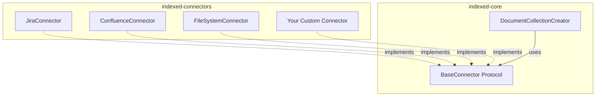
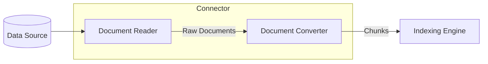

# Connector Architecture

Connectors are the plugin system for data sources in Indexed. They implement a protocol-based design that allows new data sources to be added without modifying core code.

## Plugin Architecture



The core package only depends on the `BaseConnector` protocol, not specific implementations. This enables true plugin architecture.

## BaseConnector Protocol

All connectors must implement this protocol:

```python
from typing import Protocol, runtime_checkable, ClassVar

@runtime_checkable
class BaseConnector(Protocol):
    """Protocol for document source connectors."""

    META: ClassVar[Any]  # Optional metadata

    @property
    def reader(self):
        """Document reader instance."""
        ...

    @property
    def converter(self):
        """Document converter instance."""
        ...

    @property
    def connector_type(self) -> str:
        """Unique identifier (e.g., 'jira', 'confluence', 'files')."""
        ...

    @classmethod
    def from_config(cls, config_service: Any) -> "BaseConnector":
        """Create instance from ConfigService."""
        ...
```

## Reader/Converter Pattern

Each connector separates concerns into two components:



### Document Reader

Responsible for fetching raw documents from the source:

```python
class JiraDocumentReader:
    def get_number_of_documents(self) -> int:
        """Return total document count for progress tracking."""
        ...

    def read_all_documents(self) -> Iterator[dict]:
        """Yield raw documents from source."""
        for issue in self._fetch_issues():
            yield {
                "id": issue["key"],
                "content": issue["fields"]["description"],
                "metadata": {
                    "summary": issue["fields"]["summary"],
                    "status": issue["fields"]["status"]["name"],
                    "created": issue["fields"]["created"],
                }
            }
```

### Document Converter

Transforms raw documents into searchable chunks:

```python
class JiraDocumentConverter:
    def convert(self, document: dict) -> list[dict]:
        """Convert raw document to list of chunks."""
        chunks = []

        # Create main chunk from description
        if document.get("content"):
            chunks.append({
                "id": f"{document['id']}_main",
                "text": document["content"],
                "metadata": document["metadata"],
            })

        # Create chunk from comments
        for i, comment in enumerate(document.get("comments", [])):
            chunks.append({
                "id": f"{document['id']}_comment_{i}",
                "text": comment["body"],
                "metadata": {**document["metadata"], "type": "comment"},
            })

        return chunks
```

## Available Connectors

### Jira Connector

Indexes issues from Jira Server/DC or Jira Cloud.

```python
from connectors.jira import JiraConnector, JiraCloudConnector

# Server/DC
connector = JiraConnector(
    url="https://jira.company.com",
    query="project = PROJ",
    token="your-pat-token"
)

# Cloud
connector = JiraCloudConnector(
    url="https://company.atlassian.net",
    email="user@company.com",
    query="project = PROJ",
    api_token="your-api-token"
)
```

**Config Path:** `sources.jira`

**Features:**
- JQL query support
- Issue descriptions and comments
- Attachment metadata
- Custom field support

### Confluence Connector

Indexes pages from Confluence Server/DC or Confluence Cloud.

```python
from connectors.confluence import ConfluenceConnector, ConfluenceCloudConnector

# Server/DC
connector = ConfluenceConnector(
    url="https://confluence.company.com",
    query="space = DEV",
    token="your-pat-token"
)

# Cloud
connector = ConfluenceCloudConnector(
    url="https://company.atlassian.net/wiki",
    email="user@company.com",
    query="space = DEV",
    api_token="your-api-token"
)
```

**Config Path:** `sources.confluence`

**Features:**
- CQL query support
- Page body content
- Comments (optional)
- Space filtering

### File System Connector

Indexes local files with configurable patterns.

```python
from connectors.files import FileSystemConnector

connector = FileSystemConnector(
    path="./documents",
    include_patterns=["*.md", "*.txt", "*.pdf"],
    exclude_patterns=["*.draft.md"],
    fail_fast=False
)
```

**Config Path:** `sources.files`

**Features:**
- Glob pattern matching
- 20+ file formats via `unstructured`
- Recursive directory scanning
- Graceful error handling

## Creating a Custom Connector

### Step 1: Define Config Model

```python
# my_connector/schema.py
from pydantic import BaseModel, Field

class MyConnectorConfig(BaseModel):
    """Configuration for MyConnector."""

    url: str = Field(..., description="API endpoint URL")
    query: str = Field(..., description="Query filter")
    api_key: str = Field(
        None,
        description="API key (env: MY_API_KEY)"
    )

    def get_api_key(self) -> str:
        import os
        return self.api_key or os.getenv("MY_API_KEY", "")
```

### Step 2: Implement Reader

```python
# my_connector/reader.py
from typing import Iterator

class MyDocumentReader:
    def __init__(self, url: str, query: str, api_key: str):
        self.url = url
        self.query = query
        self.api_key = api_key
        self._client = self._create_client()

    def _create_client(self):
        # Initialize your API client
        ...

    def get_number_of_documents(self) -> int:
        """Return total document count."""
        return self._client.count(self.query)

    def read_all_documents(self) -> Iterator[dict]:
        """Yield raw documents."""
        for item in self._client.search(self.query):
            yield {
                "id": item["id"],
                "content": item["body"],
                "metadata": {
                    "title": item["title"],
                    "created": item["created_at"],
                }
            }
```

### Step 3: Implement Converter

```python
# my_connector/converter.py
from typing import List

class MyDocumentConverter:
    def __init__(self, chunk_size: int = 512):
        self.chunk_size = chunk_size

    def convert(self, document: dict) -> List[dict]:
        """Convert raw document to chunks."""
        content = document.get("content", "")
        chunks = []

        # Simple chunking by size
        for i in range(0, len(content), self.chunk_size):
            chunk_text = content[i:i + self.chunk_size]
            chunks.append({
                "id": f"{document['id']}_{i}",
                "text": chunk_text,
                "metadata": document["metadata"],
            })

        return chunks
```

### Step 4: Implement Connector

```python
# my_connector/connector.py
from typing import ClassVar
from indexed_config import ConfigService
from core.v1.connectors import BaseConnector
from core.v1.connectors.metadata import ConnectorMetadata

from .schema import MyConnectorConfig
from .reader import MyDocumentReader
from .converter import MyDocumentConverter

class MyConnector:
    """Connector for MyService."""

    META: ClassVar[ConnectorMetadata] = ConnectorMetadata(
        name="my_connector",
        display_name="My Service",
        description="Index documents from My Service",
        config_class=MyConnectorConfig,
        version="1.0.0",
    )

    def __init__(self, url: str, query: str, api_key: str):
        self._reader = MyDocumentReader(url, query, api_key)
        self._converter = MyDocumentConverter()

    @property
    def reader(self) -> MyDocumentReader:
        return self._reader

    @property
    def converter(self) -> MyDocumentConverter:
        return self._converter

    @property
    def connector_type(self) -> str:
        return "my_connector"

    @classmethod
    def from_config(cls, config_service: ConfigService) -> "MyConnector":
        """Create connector from ConfigService."""
        config_service.register(MyConnectorConfig, path="sources.my_connector")
        provider = config_service.bind()
        cfg = provider.get(MyConnectorConfig)

        return cls(
            url=cfg.url,
            query=cfg.query,
            api_key=cfg.get_api_key(),
        )
```

### Step 5: Register Connector (Optional)

Add to connector registry for CLI auto-discovery:

```python
# connectors/registry.py
from .my_connector import MyConnector

CONNECTOR_REGISTRY = {
    "my_connector": MyConnector,
    # ... other connectors
}
```

## ConnectorMetadata

Optional metadata class for connector discovery:

```python
from dataclasses import dataclass
from typing import Type
from pydantic import BaseModel

@dataclass
class ConnectorMetadata:
    name: str                          # Unique identifier
    display_name: str                  # Human-readable name
    description: str                   # Short description
    config_class: Type[BaseModel]      # Pydantic config model
    version: str                       # Connector version
    min_core_version: str = "1.0.0"    # Minimum core compatibility
```

## Testing Connectors

```python
import pytest
from unittest.mock import Mock, patch

def test_my_connector_reads_documents():
    # Arrange
    mock_client = Mock()
    mock_client.search.return_value = [
        {"id": "1", "body": "content", "title": "Test", "created_at": "2024-01-01"}
    ]

    reader = MyDocumentReader(
        url="https://api.example.com",
        query="test",
        api_key="key"
    )
    reader._client = mock_client

    # Act
    docs = list(reader.read_all_documents())

    # Assert
    assert len(docs) == 1
    assert docs[0]["id"] == "1"

def test_my_connector_converts_to_chunks():
    # Arrange
    converter = MyDocumentConverter(chunk_size=100)
    document = {
        "id": "doc1",
        "content": "x" * 250,
        "metadata": {"title": "Test"}
    }

    # Act
    chunks = converter.convert(document)

    # Assert
    assert len(chunks) == 3
    assert all(c["metadata"]["title"] == "Test" for c in chunks)
```

## Best Practices

1. **Separate Reader and Converter** - Keep concerns cleanly separated
2. **Yield Documents** - Use generators for memory efficiency
3. **Handle Errors Gracefully** - Log and skip bad documents, don't crash
4. **Provide Progress Info** - Implement `get_number_of_documents()` accurately
5. **Use Config Models** - Define Pydantic models for type safety
6. **Document Environment Variables** - Note required env vars in field descriptions
