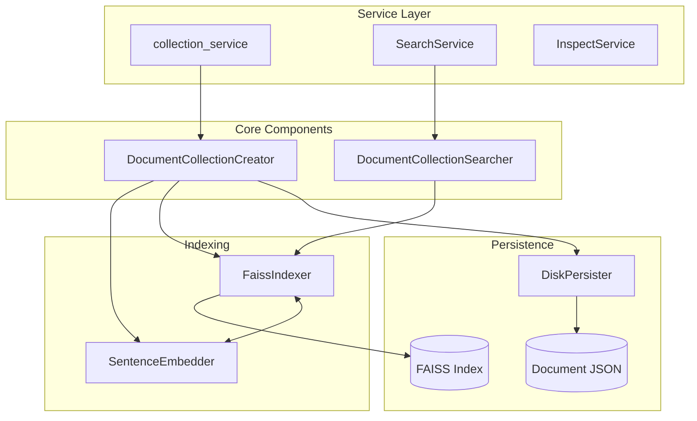
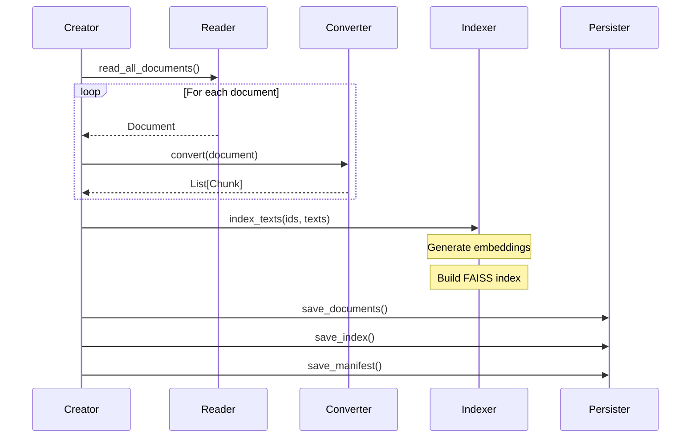

# Core Engine

The core engine in `indexed-core` handles document indexing, vector embeddings, similarity search, and persistence. This document covers the internal mechanics.

## Engine Architecture



## Document Collection Creator

The `DocumentCollectionCreator` orchestrates the indexing pipeline:

```python
# packages/indexed-core/src/core/v1/engine/core/documents_collection_creator.py

class DocumentCollectionCreator:
    """Creates and indexes a document collection."""

    def __init__(
        self,
        collection_name: str,
        indexers: List[str],
        document_reader: Any,
        document_converter: Any,
        use_cache: bool = True,
    ):
        self.collection_name = collection_name
        self.indexers = indexers
        self.reader = document_reader
        self.converter = document_converter
        self.use_cache = use_cache

    def run(self) -> None:
        """Execute the indexing pipeline."""
        # 1. Read documents from source
        documents = list(self.reader.read_all_documents())

        # 2. Convert to chunks
        all_chunks = []
        for doc in documents:
            chunks = self.converter.convert(doc)
            all_chunks.extend(chunks)

        # 3. Index chunks
        indexer = self._get_indexer()
        ids = [c["id"] for c in all_chunks]
        texts = [c["text"] for c in all_chunks]
        indexer.index_texts(ids, texts)

        # 4. Persist to disk
        self._persist(documents, all_chunks, indexer)
```

### Indexing Pipeline Steps



## FAISS Indexer

The `FaissIndexer` wraps FAISS for vector storage and similarity search:

```python
# packages/indexed-core/src/core/v1/engine/indexes/indexers/faiss_indexer.py

class FaissIndexer:
    """FAISS-based vector indexer with sentence-transformer embeddings."""

    def __init__(
        self,
        embedder: SentenceEmbedder,
        index_type: str = "IndexFlatL2",
    ):
        self.embedder = embedder
        self.index_type = index_type
        self.index = None
        self.id_to_idx = {}  # Map document IDs to index positions

    def index_texts(self, ids: List[str], texts: List[str]) -> None:
        """Index texts with their IDs."""
        # Generate embeddings
        embeddings = self.embedder.embed_batch(texts)

        # Create FAISS index
        dimension = embeddings.shape[1]
        self.index = faiss.IndexFlatL2(dimension)
        self.index.add(embeddings)

        # Store ID mapping
        for i, id_ in enumerate(ids):
            self.id_to_idx[id_] = i

    def search(
        self,
        query: str,
        k: int = 10
    ) -> Tuple[np.ndarray, np.ndarray]:
        """Search for similar documents."""
        # Embed query
        query_embedding = self.embedder.embed_text(query)
        query_embedding = query_embedding.reshape(1, -1)

        # FAISS search
        distances, indices = self.index.search(query_embedding, k)

        return distances[0], indices[0]
```

### FAISS Index Types

| Type | Description | Use Case |
|------|-------------|----------|
| `IndexFlatL2` | Exact L2 distance search | Default, up to 100K vectors |
| `IndexIVFFlat` | Inverted file index | 100K-1M vectors |
| `IndexHNSW` | Hierarchical NSW | Fast approximate search |

## Sentence Embedder

Wraps sentence-transformers for text embedding:

```python
# packages/indexed-core/src/core/v1/engine/indexes/embeddings/sentence_embedder.py

class SentenceEmbedder:
    """Sentence-transformer based text embedder."""

    def __init__(self, model_name: str = "all-MiniLM-L6-v2"):
        self.model_name = model_name
        self._model = None

    @property
    def model(self):
        """Lazy load model on first use."""
        if self._model is None:
            from sentence_transformers import SentenceTransformer
            self._model = SentenceTransformer(self.model_name)
        return self._model

    def embed_text(self, text: str) -> np.ndarray:
        """Embed a single text."""
        return self.model.encode(text, convert_to_numpy=True)

    def embed_batch(self, texts: List[str]) -> np.ndarray:
        """Embed multiple texts efficiently."""
        return self.model.encode(
            texts,
            convert_to_numpy=True,
            batch_size=32,
            show_progress_bar=False,
        )
```

### Available Embedding Models

| Model | Dimensions | Speed | Quality |
|-------|------------|-------|---------|
| `all-MiniLM-L6-v2` | 384 | Fast | Good (default) |
| `all-mpnet-base-v2` | 768 | Medium | Better |
| `all-MiniLM-L12-v2` | 384 | Fast | Good |

## Document Collection Searcher

Handles search operations with caching:

```python
# packages/indexed-core/src/core/v1/engine/core/documents_collection_searcher.py

class DocumentCollectionSearcher:
    """Searches an indexed document collection."""

    def __init__(self, collection_path: Path):
        self.collection_path = collection_path
        self._indexer = None
        self._documents = None

    def search(
        self,
        query: str,
        max_results: int = 10
    ) -> List[SearchResult]:
        """Search for documents matching query."""
        # Get cached indexer
        indexer = self._get_indexer()

        # Perform search
        distances, indices = indexer.search(query, k=max_results)

        # Build results
        results = []
        for dist, idx in zip(distances, indices):
            if idx >= 0:  # Valid index
                chunk = self._get_chunk(idx)
                results.append(SearchResult(
                    chunk_id=chunk["id"],
                    text=chunk["text"],
                    score=1.0 / (1.0 + dist),  # Convert distance to similarity
                    metadata=chunk["metadata"],
                ))

        return results
```

## Service Layer

### collection_service (Functional)

Stateless functions for collection operations:

```python
# packages/indexed-core/src/core/v1/engine/services/collection_service.py

def create(
    configs: List[SourceConfig],
    config_service: ConfigService = None,
) -> None:
    """Create one or more collections."""
    for cfg in configs:
        connector = _build_connector_from_config(cfg, config_service)
        creator = create_collection_creator(
            collection_name=cfg.name,
            indexers=[cfg.indexer],
            document_reader=connector.reader,
            document_converter=connector.converter,
        )
        creator.run()

def update(configs: List[SourceConfig]) -> None:
    """Update existing collections with new documents."""
    for cfg in configs:
        updater = create_collection_updater(cfg.name)
        updater.run()

def clear(collection_names: List[str]) -> None:
    """Delete collections and their data."""
    for name in collection_names:
        collection_path = get_collection_path(name)
        if collection_path.exists():
            shutil.rmtree(collection_path)
```

### SearchService (Class-based)

Stateful service with cached searchers:

```python
# packages/indexed-core/src/core/v1/engine/services/search_service.py

class SearchService:
    """Search service with cached searchers."""

    def __init__(self):
        self._searchers: Dict[str, DocumentCollectionSearcher] = {}

    def search(
        self,
        query: str,
        configs: List[SourceConfig] = None,
        max_docs: int = 10,
        max_chunks: int = 30,
    ) -> Dict[str, List[SearchResult]]:
        """Search across collections."""
        # Discover collections if not specified
        if configs is None:
            configs = discover_all_collections()

        results = {}
        for cfg in configs:
            searcher = self._get_or_create_searcher(cfg.name)
            results[cfg.name] = searcher.search(query, max_chunks)

        return results

    def _get_or_create_searcher(self, name: str) -> DocumentCollectionSearcher:
        """Get cached searcher or create new one."""
        if name not in self._searchers:
            path = get_collection_path(name)
            self._searchers[name] = DocumentCollectionSearcher(path)
        return self._searchers[name]
```

### InspectService (Class-based)

Collection inspection and status:

```python
# packages/indexed-core/src/core/v1/engine/services/inspect_service.py

class InspectService:
    """Inspect collections and retrieve metadata."""

    def status(
        self,
        collection_names: List[str] = None
    ) -> List[CollectionStatus]:
        """Get status of collections."""
        if collection_names is None:
            collection_names = discover_all_collection_names()

        statuses = []
        for name in collection_names:
            manifest = self._load_manifest(name)
            statuses.append(CollectionStatus(
                name=name,
                number_of_documents=manifest.get("document_count", 0),
                number_of_chunks=manifest.get("chunk_count", 0),
                indexers=manifest.get("indexers", []),
                connector_type=manifest.get("connector_type"),
                created_at=manifest.get("created_at"),
            ))

        return statuses
```

## Index Facade

High-level API for library users:

```python
# packages/indexed-core/src/core/v1/index.py

class Index:
    """Main interface for indexed document search."""

    def __init__(self, config: IndexConfig = None):
        self.config = config or IndexConfig()
        self._collections: Dict[str, BaseConnector] = {}

    def add_collection(self, name: str, connector: BaseConnector) -> None:
        """Add and index a new collection."""
        creator = create_collection_creator(
            collection_name=name,
            indexers=[self.config.default_indexer],
            document_reader=connector.reader,
            document_converter=connector.converter,
        )
        creator.run()
        self._collections[name] = connector

    def search(
        self,
        query: str,
        collection: str = None,
        max_results: int = 10
    ) -> Dict[str, Any]:
        """Search across collections."""
        return search(
            query,
            configs=self._get_configs(collection),
            max_docs=max_results,
        )

    def status(self, collection: str = None):
        """Get collection status."""
        names = [collection] if collection else None
        return status(names)

    def remove(self, collection: str) -> None:
        """Remove a collection."""
        clear([collection])
        self._collections.pop(collection, None)
```

## Data Models

### SourceConfig

Configuration for a data source:

```python
@dataclass
class SourceConfig:
    name: str           # Collection name
    type: str           # Connector type (jira, confluence, files)
    base_url_or_path: str
    indexer: str        # Indexer name
```

### SearchResult

Search result with chunk data:

```python
@dataclass
class SearchResult:
    chunk_id: str
    text: str
    score: float
    metadata: Dict[str, Any]
```

### CollectionStatus

Collection metadata:

```python
@dataclass
class CollectionStatus:
    name: str
    number_of_documents: int
    number_of_chunks: int
    indexers: List[str]
    connector_type: str
    created_at: str
```

## Factory Functions

### create_collection_creator

```python
def create_collection_creator(
    collection_name: str,
    indexers: List[str],
    document_reader: Any,
    document_converter: Any,
    use_cache: bool = True,
) -> DocumentCollectionCreator:
    """Create a DocumentCollectionCreator instance."""
    return DocumentCollectionCreator(
        collection_name=collection_name,
        indexers=indexers,
        document_reader=document_reader,
        document_converter=document_converter,
        use_cache=use_cache,
    )
```

### create_collection_updater

```python
def create_collection_updater(
    collection_name: str,
) -> DocumentCollectionUpdater:
    """Create an updater from existing collection manifest."""
    manifest = load_manifest(collection_name)
    connector = rebuild_connector_from_manifest(manifest)

    return DocumentCollectionUpdater(
        collection_name=collection_name,
        document_reader=connector.reader,
        document_converter=connector.converter,
    )
```

## Performance Optimizations

| Optimization | Implementation |
|--------------|----------------|
| Batch embedding | Process texts in batches of 32 |
| Lazy model loading | Load embedding model on first use |
| Searcher caching | Cache searcher instances per collection |
| Memory mapping | Use `mmap` for large FAISS indexes |
| Index persistence | Binary FAISS index for fast loading |

## Default Configuration

```python
# packages/indexed-core/src/core/v1/constants.py

DEFAULT_INDEXER = "indexer_FAISS_IndexFlatL2__embeddings_all-MiniLM-L6-v2"

# Indexer naming convention:
# indexer_{FAISS_INDEX_TYPE}__embeddings_{MODEL_NAME}
```

The default configuration uses:
- **FAISS IndexFlatL2** - Exact L2 distance search
- **all-MiniLM-L6-v2** - 384-dimension embeddings, good balance of speed/quality
