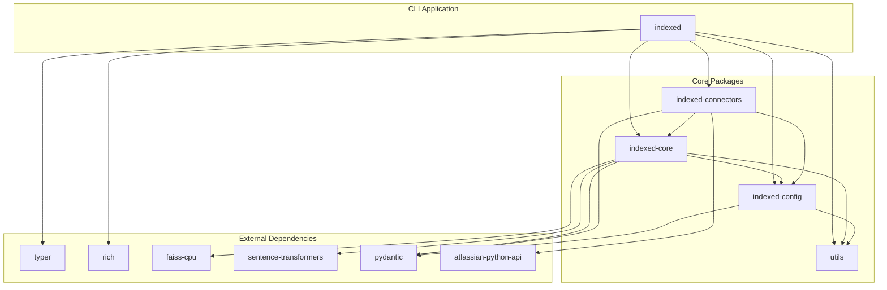
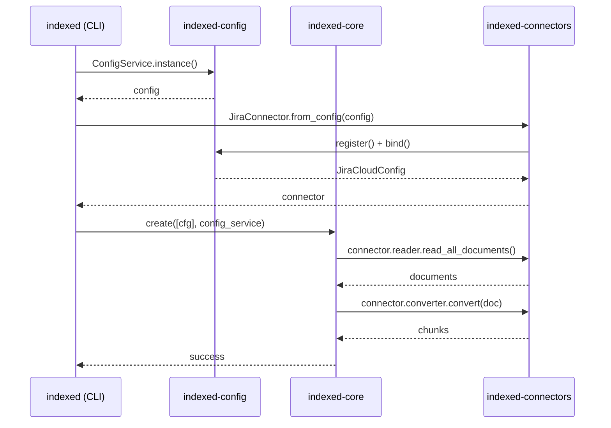
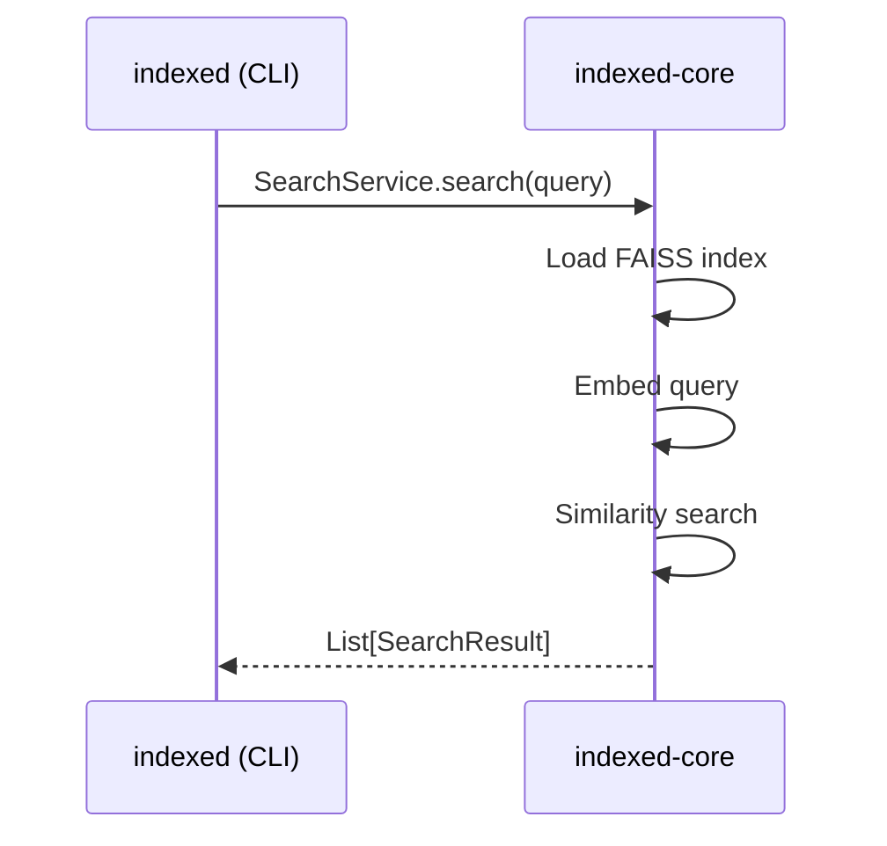

# Package Structure

Indexed uses a monorepo architecture with clearly separated packages. This design enables independent versioning, focused testing, and clean dependency boundaries.

## Monorepo Layout

```
indexed/
├── indexed/                    # Main CLI application
│   └── src/indexed/
│       ├── app.py             # Typer entry point
│       ├── knowledge/         # Index management commands
│       ├── config/            # Config CLI commands
│       ├── mcp/               # MCP server
│       └── utils/             # CLI utilities, Rich components
│
├── packages/
│   ├── indexed-core/          # Core library
│   │   └── src/core/v1/
│   │       ├── index.py       # Index facade
│   │       ├── connectors/    # BaseConnector protocol
│   │       └── engine/        # Services, indexers, persisters
│   │
│   ├── indexed-connectors/    # Data source connectors
│   │   └── src/connectors/
│   │       ├── jira/          # Jira connector
│   │       ├── confluence/    # Confluence connector
│   │       └── files/         # File system connector
│   │
│   ├── indexed-config/        # Configuration management
│   │   └── src/indexed_config/
│   │       ├── service.py     # ConfigService
│   │       ├── store.py       # TOML I/O
│   │       └── provider.py    # Typed config access
│   │
│   └── utils/                 # Shared utilities
│       └── src/utils/
│           ├── logger.py      # Loguru setup
│           ├── batch.py       # Batch processing
│           └── retry.py       # Retry decorators
│
├── tests/                     # Test suite
├── docs/                      # Documentation
└── pyproject.toml            # Root workspace config
```

## Package Dependency Graph



## Package Details

### `indexed` - CLI Application

The main entry point for users. Provides the `indexed-cli` command.

**Location:** `indexed/src/indexed/`

**Key Files:**
| File | Purpose |
|------|---------|
| `app.py` | Typer app setup, global flags, logging init |
| `knowledge/commands/*.py` | create, search, inspect, update, remove commands |
| `config/cli.py` | inspect, set, validate, delete config commands |
| `mcp/server.py` | FastMCP server for AI integration |
| `utils/components/` | Rich panels, cards, status indicators |

**Entry Points:**
```toml
[project.scripts]
indexed-cli = "indexed.app:main"
indexed-mcp = "indexed.mcp.server:main"
```

**Dependencies:**
- `indexed-core` - Core functionality
- `indexed-connectors` - Data source connectors
- `indexed-config` - Configuration management
- `typer` - CLI framework
- `rich` - Terminal UI

---

### `indexed-core` - Core Library

The heart of Indexed. Contains the indexing engine, search functionality, and public API.

**Location:** `packages/indexed-core/src/core/v1/`

**Structure:**
```
core/v1/
├── index.py              # Index facade class
├── config_models.py      # Pydantic config models
├── constants.py          # Default indexer name
├── connectors/
│   ├── base.py          # BaseConnector protocol
│   └── metadata.py      # ConnectorMetadata
└── engine/
    ├── core/
    │   ├── documents_collection_creator.py
    │   └── documents_collection_searcher.py
    ├── services/
    │   ├── collection_service.py
    │   ├── search_service.py
    │   └── inspect_service.py
    ├── indexes/
    │   ├── embeddings/sentence_embedder.py
    │   └── indexers/faiss_indexer.py
    └── persisters/
        └── disk_persister.py
```

**Public API:**
```python
from core.v1 import Index, IndexConfig
from core.v1.connectors import BaseConnector
from core.v1.engine.services import create, search, status, update, clear
```

**Dependencies:**
- `indexed-config` - Configuration
- `faiss-cpu` - Vector storage
- `sentence-transformers` - Embeddings
- `pydantic` - Validation

---

### `indexed-connectors` - Data Source Connectors

Implementations of `BaseConnector` for various data sources.

**Location:** `packages/indexed-connectors/src/connectors/`

**Available Connectors:**

| Connector | Source | Config Model |
|-----------|--------|--------------|
| `JiraConnector` | Jira Server/DC | `JiraConfig` |
| `JiraCloudConnector` | Jira Cloud | `JiraCloudConfig` |
| `ConfluenceConnector` | Confluence Server/DC | `ConfluenceConfig` |
| `ConfluenceCloudConnector` | Confluence Cloud | `ConfluenceCloudConfig` |
| `FileSystemConnector` | Local files | `FileSystemConfig` |

**Structure per connector:**
```
jira/
├── __init__.py           # Exports
├── connector.py          # JiraConnector, JiraCloudConnector
├── schema.py             # Pydantic config models
├── jira_document_reader.py
├── jira_document_converter.py
├── jira_cloud_document_reader.py
└── jira_cloud_document_converter.py
```

**Dependencies:**
- `indexed-core` - BaseConnector protocol
- `atlassian-python-api` - Jira/Confluence API client
- `unstructured` - Document parsing

---

### `indexed-config` - Configuration Management

Unified configuration system with TOML support, environment variables, and Pydantic validation.

**Location:** `packages/indexed-config/src/indexed_config/`

**Key Components:**
| File | Class/Function | Purpose |
|------|----------------|---------|
| `service.py` | `ConfigService` | Main config API |
| `provider.py` | `Provider` | Typed config access |
| `store.py` | `TomlStore` | TOML file I/O |
| `storage.py` | `StorageResolver` | Path resolution |
| `path_utils.py` | `get_by_path()` | Dot-path navigation |

**Public API:**
```python
from indexed_config import ConfigService

config = ConfigService()
config.register(MyConfig, path="sources.myconnector")
provider = config.bind()
cfg = provider.get(MyConfig)
```

**Dependencies:**
- `pydantic` - Validation
- `platformdirs` - Cross-platform paths

---

### `utils` - Shared Utilities

Common utilities used across packages.

**Location:** `packages/utils/src/utils/`

**Available Utilities:**
| Module | Purpose |
|--------|---------|
| `logger.py` | Loguru configuration |
| `batch.py` | Batch processing helpers |
| `retry.py` | Retry decorators with backoff |
| `performance.py` | Timing decorators |
| `safe_getattr.py` | Safe attribute access |

**Usage:**
```python
from utils import logger, batch_process, retry_with_backoff
```

---

## How Packages Interact

### Indexing Flow



### Search Flow



## Development Commands

Each package can be developed and tested independently:

```bash
# Install all packages in editable mode
uv sync --all-groups

# Run tests for a specific package
uv run pytest tests/packages/indexed-core/ -q

# Type check a package
uv run mypy packages/indexed-core/src

# Lint
uv run ruff check packages/
```

## Adding a New Package

1. Create directory under `packages/`:
   ```
   packages/indexed-mypackage/
   ├── pyproject.toml
   ├── README.md
   └── src/mypackage/
       └── __init__.py
   ```

2. Add to root `pyproject.toml`:
   ```toml
   [tool.uv.sources]
   indexed-mypackage = { workspace = true }
   ```

3. Add dependency in consuming packages:
   ```toml
   dependencies = ["indexed-mypackage"]
   ```

