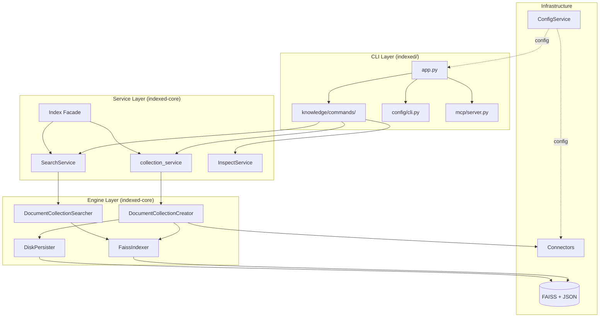
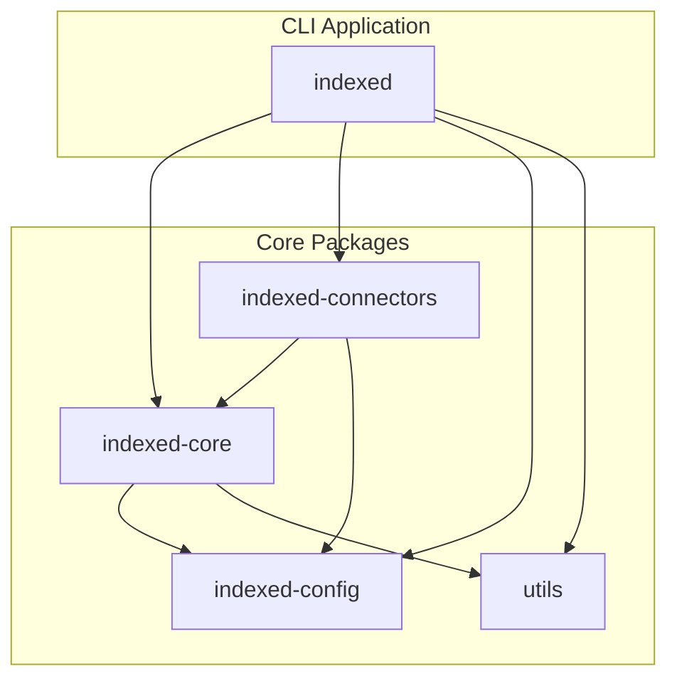
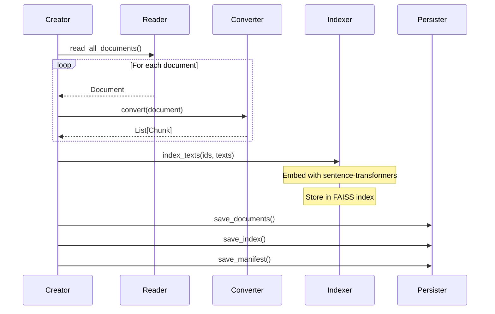

# Architecture & Internals

Welcome to the Indexed developer documentation. This guide covers the architecture, design decisions, and internal workings of the Indexed document search system.

## 1. High-Level Overview

Indexed is a privacy-first semantic document search tool built on FAISS and sentence-transformers. It indexes documents from multiple sources (Jira, Confluence, local files) and provides fast semantic search without sending data to third parties.

### System Layers

The system is organized into three primary layers:



### Layer Responsibilities

#### CLI Layer (`indexed/src/indexed/`)
The user interface layer handles command parsing, output formatting, and user interactions.
- `app.py`: Main Typer application, global flags.
- `knowledge/`: Index operations (create, search, inspect).
- `mcp/`: FastMCP server for AI integration.

#### Service Layer (`packages/indexed-core/`)
Business logic and orchestration of core operations.
- `collection_service`: Stateless operations (`create`, `update`).
- `SearchService`: Semantic search with cached searchers.
- `Index`: Facade for library usage.

#### Infrastructure Layer
Low-level components for data access and storage.
- `ConfigService`: TOML config loading and validation.
- `Connectors`: Document reading from sources.
- `FaissIndexer`: Vector embedding and similarity search.

---

## 2. Package Structure

Indexed uses a monorepo architecture with clearly separated packages. This design enables independent versioning, focused testing, and clean dependency boundaries.

### Monorepo Layout

```
indexed/
├── indexed/                    # Main CLI application
│   └── src/indexed/
│       ├── app.py             # Typer entry point
│       └── ...
│
├── packages/
│   ├── indexed-core/          # Core library
│   │   └── src/core/v1/       # Engine, Services, Facade
│   │
│   ├── indexed-connectors/    # Data source connectors
│   │   └── src/connectors/    # Jira, Confluence, Files
│   │
│   ├── indexed-config/        # Configuration management
│   │   └── src/indexed_config/# ConfigService, Store
│   │
│   └── utils/                 # Shared utilities
│       └── src/utils/         # Logging, batching, retry
```

### Dependency Graph



---

## 3. Core Engine

The core engine in `indexed-core` handles document indexing, vector embeddings, similarity search, and persistence.

### Indexing Pipeline

When a user creates a new collection, data flows through this pipeline:



### Components

#### DocumentCollectionCreator
Orchestrates reading, converting, indexing, and persisting.

#### FaissIndexer
Wraps FAISS for vector storage and `sentence-transformers` for embedding.
- **Index Type:** Default is `IndexFlatL2` (Exact L2 distance).
- **Embedder:** Default model is `all-MiniLM-L6-v2` (384 dimensions).

#### DocumentCollectionSearcher
Handles search operations with caching to avoid reloading indexes.

### Storage Architecture
Collections are stored in a structured directory hierarchy (`~/.indexed/data/collections/` by default):
- `manifest.json`: Collection metadata.
- `documents/`: JSON files containing chunk text and metadata.
- `indexes/`: Binary FAISS indexes and mapping files.

---

## 4. Connectors

Connectors are the plugin system for data sources. They implement a protocol-based design that allows new data sources to be added without modifying core code.

### Protocol

All connectors must implement the `BaseConnector` protocol:

```python
@runtime_checkable
class BaseConnector(Protocol):
    @property
    def reader(self): ...
    @property
    def converter(self): ...
    @property
    def connector_type(self) -> str: ...
    @classmethod
    def from_config(cls, config_service: Any) -> "BaseConnector": ...
```

### Reader/Converter Pattern

- **Document Reader:** Fetches raw documents from the source (e.g., Jira API, Filesystem). Yields raw dicts.
- **Document Converter:** Transforms raw documents into searchable chunks (text + metadata).

### Available Connectors
- **Jira:** Server/DC (`JiraConnector`) and Cloud (`JiraCloudConnector`).
- **Confluence:** Server/DC (`ConfluenceConnector`) and Cloud (`ConfluenceCloudConnector`).
- **File System:** Local files (`FileSystemConnector`) using `unstructured`.

---

## 5. Configuration System

The `indexed-config` package provides a unified configuration system built on explicit registration, Pydantic validation, and automatic secret handling.

### Config Hierarchy

Configuration values are merged in order of increasing priority:
1.  **Pydantic Defaults** (Lowest)
2.  **Global Config** (`~/.indexed/config.toml`)
3.  **Workspace Config** (`./.indexed/config.toml`)
4.  **Environment Variables** (`INDEXED__section__key`)
5.  **CLI Arguments** (Highest)

### ConfigService Pattern

```python
# 1. Register spec
config.register(JiraCloudConfig, path="sources.jira")

# 2. Bind and get typed instance
provider = config.bind()
cfg = provider.get(JiraCloudConfig)

# 3. Use
print(cfg.url)
```

### Secret Management
Fields named `token`, `password`, `secret`, or `api_key` are automatically routed to `.env` files instead of `config.toml` to prevent committing credentials.
