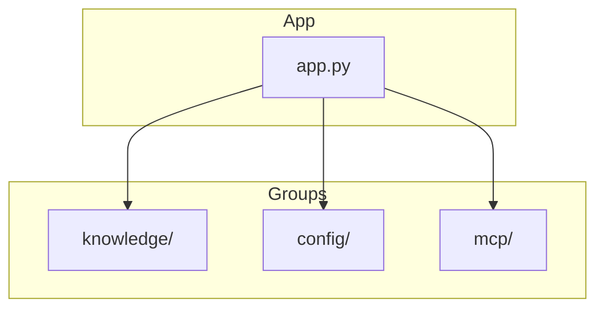

# CLI Implementation

The Indexed CLI is built with **Typer** and **Rich**, providing a polished terminal experience with consistent styling and clear feedback. This document details the implementation patterns used in the `indexed` package.

## 1. Command Architecture

### Entry Point (`app.py`)

The main entry point uses a `Typer` callback to handle global setup like logging and storage mode resolution before any command is executed.

```python
@app.callback(invoke_without_command=True)
def _init_app(
    ctx: typer.Context,
    verbose: bool = typer.Option(False, "--verbose"),
    # ...
) -> None:
    setup_root_logger(...)
    config_service = ConfigService.instance(...)
    ctx.obj = {"config_service": config_service}
```

### Command Groups

Commands are organized in subdirectories but exposed in a flat structure for usability.



- **Knowledge:** `create`, `search`, `inspect`, `update` (Registered as `index create`, etc.)
- **Config:** `inspect`, `set`, `validate`
- **MCP:** `run`, `dev`, `inspect`

## 2. Storage Mode Resolution

Indexed supports `Global` (~/.indexed) and `Local` (./.indexed) storage modes.

**Resolution Logic:**
1.  **Global Flags:** `--local` or `--global` passed to the command (parsed early).
2.  **Config:** `storage.mode` setting in `config.toml`.
3.  **Presence:** If `.indexed/` exists in the current directory, it defaults to Local.
4.  **Fallback:** Global mode.

## 3. Rich UI Patterns

We use `rich` for all terminal output to ensure consistency.

### Standard Components

-   **Info Cards:** `Panel` based cards for displaying search results or object summaries.
-   **Status Indicators:** Colored icons (`✓`, `✗`, `!`) for success/error/warning.
-   **Progress Bars:** Spinner + Bar for long-running indexing operations.

### Theme System

A central theme definition ensures colors are consistent across the app:
-   **Accent:** Teal (`#00D4AA`) used for commands and highlights.
-   **Secondary:** Dim/Grey for metadata.

## 4. Logging Strategy

Logging is handled via `loguru` with three distinct levels of verbosity:

1.  **Default (Quiet):** Only Warnings and Errors are shown. Standard output is reserved for command results (like search hits).
2.  **Verbose (`--verbose`):** INFO level logs. Shows progress steps (e.g., "Connecting to Jira...", "Indexed 50 documents").
3.  **Debug (`--log-level=DEBUG`):** DEBUG level logs. Shows internal details, timings, and HTTP requests.

## 5. MCP Server Integration

The CLI includes an embedded MCP server (`indexed/mcp/server.py`) built with `FastMCP`.

-   **Transport:** Stdio (default) for local integration with Claude Desktop.
-   **Tools:** Exposes `search(query)` and `list_collections()` to the LLM.
-   **Context:** Reuses the same `SearchService` and `ConfigService` as the CLI, ensuring the agent sees exactly what the user sees.
