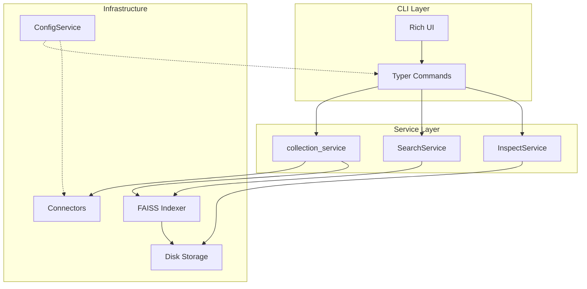

# Developer Documentation

Welcome to the Indexed developer documentation. This guide covers the architecture, design decisions, and internal workings of the Indexed document search system.

## What is Indexed?

Indexed is a privacy-first semantic document search tool built on FAISS and sentence-transformers. It indexes documents from multiple sources (Jira, Confluence, local files) and provides fast semantic search without sending data to third parties.

## Architecture at a Glance



## Documentation Guide

| Document | Description |
|----------|-------------|
| [Architecture](./architecture) | System design, data flows, and layer responsibilities |
| [Packages](./packages) | Monorepo structure and package dependencies |
| [Configuration System](./config-system) | ConfigService design and config management |
| [Connectors](./connectors) | Connector protocol and how to extend data sources |
| [Core Engine](./core-engine) | Indexing pipeline, search mechanics, and services |
| [CLI Design](./cli-design) | Command structure, Rich UI, and logging |

## Prerequisites

Before diving into the codebase, ensure you have:

- **Python 3.10+** installed
- **uv** package manager ([install guide](https://github.com/astral-sh/uv))
- Basic understanding of:
  - Vector embeddings and similarity search
  - Pydantic data validation
  - Typer CLI framework

## Quick Setup

```bash
# Clone and install
git clone https://github.com/your-org/indexed.git
cd indexed

# Install all dependencies (including dev)
uv sync --all-groups

# Run the CLI
uv run indexed-cli --help

# Run tests
uv run pytest -q
```

## Key Design Principles

1. **KISS** - Simple solutions over complex abstractions
2. **Privacy-First** - Local processing by default
3. **Type Safety** - Pydantic validation and type hints throughout
4. **Extensible** - Protocol-based connector system for new data sources
5. **Configuration-Driven** - Behavior controlled via TOML config files

## Resources

- [GitHub Repository](https://github.com/your-org/indexed)
- [Package READMEs](/packages) - Individual package documentation

