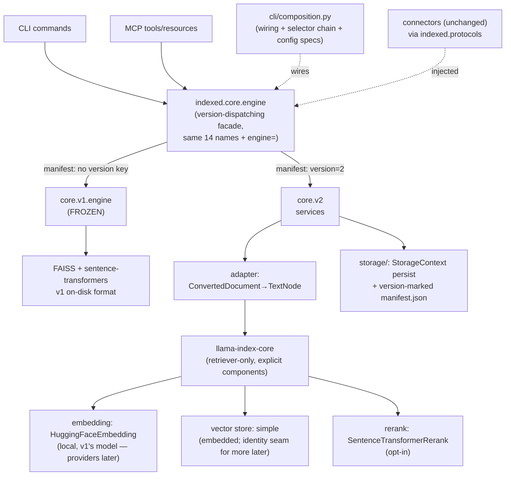

# Indexed V2 — Planning & Specification (LlamaIndex core)

> **Type:** technical + product planning document · **Feature:** core-v2
> **Branch:** `claude/indexed-v2-architecture-54i6vs`
> **Spec source of truth:** [`.spec/features/core-v2/`](../.spec/features/core-v2/product.md)
> ([product](../.spec/features/core-v2/product.md) ·
> [tech](../.spec/features/core-v2/tech.md) ·
> [plan](../.spec/features/core-v2/plan.md) ·
> [research](../.spec/features/core-v2/research.md))
> **Research basis:** 2026-07-18 — three repo deep-dives at HEAD (`ce76210`),
> full review of the prior V2 attempt (PR #86 + split stack #131–#136,
> including PR #132), and two LlamaIndex investigations, one with empirical
> verification against `llama-index-core==0.14.23` (clean py3.11 venv:
> import timing, LLM-free retrieval, persistence, metadata filters).
> Claims below are **verified** unless marked *assumption* or *unverified*.

---

## 1. Executive summary

Indexed V2 replaces the fixed FAISS + sentence-transformers engine with a
LlamaIndex-based core to gain a pluggable retrieval foundation — embedding
providers, vector stores, reranking — without hand-implementing every
integration. Per maintainer review (2026-07-18) the first release is
**local-only and self-contained**: the same HuggingFace model as v1 through
LlamaIndex's native integration (1:1 relevance, shared model cache), an
embedded store, and exactly two new dependencies; remote providers and
additional stores (Ollama, Qdrant, …) come later behind seams this feature
ships. V1 and V2 coexist: the existing v1 engine is **frozen** and keeps
serving every existing collection unchanged, while v2 collections carry an
on-disk version marker and a new persisted format.

The pivotal architectural finding: the repo's designed "v2 swap seam" (the
`core.v1.engine` facade) is real and load-bearing, but its premise — "a v2
engine ships behind the same names **over the same on-disk format**" — cannot
survive contact with the goals. Pluggable stores, deletes/upserts, and
metadata filters all require a new persisted format, and LlamaIndex's own
FAISS integration is strictly weaker than Indexed's v1 FAISS layer (no delete,
no filters, positional ids — verified upstream). So the seam is raised one
level: a **version-dispatching facade** (`indexed.core.engine`) with the same
14-name surface routes per collection, the **manifest is authoritative** for
existing collections (explicit selectors can only confirm or fail — never
silently override), and selectors choose the engine for **new** collections
only. This one rule eliminates the accidental-cross-engine-write class that
plagued the previous attempt.

The previous attempt (PR #86, split into #132–#136, closed unmerged) validated
the core bet — LlamaIndex retrieval works LLM-free, a boundary adapter keeps
connectors framework-free, and measured overhead was acceptable — and its
failures are now design inputs: flag-over-manifest precedence, delete-before-
persist, a FAISS-hardcoded load path, and a premature default flip are each
explicitly designed out.

Recommended build order: routing seam first (pure refactor, zero behavior
change), v2 MVP second, incremental update + characterization harness third,
then migration and reranking. Remote providers and additional stores follow
as future work behind the shipped seams. The default engine stays **v1**
until a parity report gates the flip (criteria approved 2026-07-18).

## 2. Goals and non-goals

**Goals**

- G1 — A v2 core on `llama-index-core` exposing the same CLI/MCP surface.
- G2 — Safe V1/V2 coexistence: per-collection routing, explicit selection,
  zero cross-engine reads/writes.
- G3 — Existing v1 collections keep working for every operation, unchanged.
- G4 — Local, self-contained embeddings 1:1 with v1 (same model, shared
  cache); provider extensibility designed in, shipped later.
- G5 — Embedded zero-daemon store with a recorded, dispatched store-identity
  seam; additional stores later.
- G6 — Optional local reranking; unified relevance semantics across engines.
- G7 — Explicit, safe, reversible v1→v2 migration (offline by default).
- G8 — Hold the budgets: <1 s CLI startup, no network by default, search
  within 2× v1 at documented scale.

**Non-goals** (this feature)

- Remote/API embedding providers (Ollama, OpenAI-compatible, …) and
  additional vector stores (Qdrant, …) — maintainer decision 2026-07-18:
  local-only, no new big installs; both arrive later behind this feature's
  seams.
- Knowledge graphs (LLM-gated; future sibling — see § 16/§ 18).
- Hybrid/BM25 retrieval and query fusion (future sibling on top of v2).
- Flipping the default engine to v2 (separate, evidence-gated decision).
- Automatic/implicit migration; removing or deprecating v1.
- New connectors, parsing changes, server/multi-user mode.

## 3. Key findings from research

### 3.1 Repository (verified at HEAD)

- **The facade surface is exactly 14 names** in
  `src/indexed/core/v1/engine/__init__.py` (lazy `__getattr__`):
  `SourceConfig`, `CollectionStatus`, `CollectionInfo`,
  `PhasedProgressCallback`, `create`, `update`, `clear`, `collection_exists`,
  `search`, `SearchService`, `status`, `inspect`, `InspectService`.
  `connector_factory` (create) and `manifest_factory` (update) are required
  keyword callables injected solely by `src/indexed/cli/composition.py`.
- **No version marker exists on disk.** v1 `manifest.json` has no
  `version`/`schemaVersion` key (grep + fixtures). "Marker absent = v1" is
  therefore a sound, backward-compatible detection rule.
- **The real v1 layout** is `manifest.json` + `documents/<id>.json` (chunks
  inline as `chunks[].indexedData`) + `indexes/{index_info,
  index_document_mapping,reverse_index_document_mapping}.json` +
  `indexes/<indexer>/indexer.faiss` — not the `documents.json`/`chunks.json`
  the top-level docs mention. The runtime contract is **camelCase dicts**;
  only `Manifest` is model-enforced (`CollectionSearchResult` etc. are never
  instantiated).
- **Scores:** squared L2 on unit-normalized vectors, range [0,4], lower =
  better; `mcp/formatting.py` + `search_render.py` consume
  `results[].matchedChunks[].{chunkNumber,score,content}` and sort ascending.
- **No engine selector exists anywhere** — no flag, no config key, no env
  var. Config is migration-ready though: `core.v1.*` namespaces, `[_meta]
  schema_version="1"`, `INDEXED__*` double-underscore env mapping, and
  `.spec/tech-config.md` already anticipates `core.v1.* → core.v2.*`.
- **Blast radius is small:** ~12 app modules hold lazy facade imports (6
  knowledge commands, `cli/app.py`, `_create_helpers.py`, `mcp/tools.py`,
  `mcp/resources.py`, plus config-model imports in `composition.py`,
  `mcp/server.py`, `mcp/cli.py`, `cli/init.py`).
- **The core is fully synchronous**; import gates
  (`scripts/check_imports.py`) bind any `core/**` code to
  `protocols`/`config`/`utils` only; coverage gate is 85% scoped to
  non-UI packages; ty must be 0-diagnostic tree-wide.
- **Doc drift to fix at COMPOUND:** `.spec/tech-config.md` still shows
  `ConfigService.instance()` (real API: `get_config()/reload()`) and a
  `[core.v1.vector_store]` section (real: `core.v1.storage`).

### 3.2 Prior attempt — PR #86 + split stack #131–#136 (incl. #132)

PR #132 is only the docs slice; the actual V2 lived in #86 (closed unmerged
2026-06-21, +14.9k/−2.7k) and splits #133–#136 (open, stale, written against
the deleted 7-package workspace; 465 files conflicted vs main). Verified
contents and verdicts:

| Decision from the stack | Verdict | Why |
|---|---|---|
| Boundary adapter; connectors never see LlamaIndex | **keep** | matches protocols-leaf architecture |
| Bypass LlamaIndex node parsers; own Docling/tree-sitter chunking | **keep** | product differentiator; pre-chunked nodes work |
| No `Settings` global; explicit `embed_model`; lazy imports | **keep** | verified necessary (OpenAI-by-default trap) |
| Manifest `"version": "2.x"` marker; v1 = no key | **keep** | cheap, backward-compatible detection |
| `EngineMismatchError` with actionable copy | **keep** | ready-made UX for R2 |
| MCP lifespan-resolved engine state | **keep** | single resolution point |
| Parity-capture methodology (+29% build, ~2× warm search measured) | **keep** | becomes the default-flip evidence gate |
| In-process FastMCP client + llama-index + torch **segfaults** (exit 139) | **keep (as constraint)** | v2 MCP e2e must run out-of-process |
| 5-level precedence, flag overrides manifest | **rework** | caused the mismatch-bug class; manifest must win |
| Runtime router with per-command flags + context reach-ins | **rework** | route inside one facade instead |
| `remove_collection()` before `persist()` | **rework** | build-aside + atomic swap (v1's own pattern) |
| Load path hardcodes `FaissVectorStore.from_persist_dir` | **rework** | dispatch on the manifest's recorded store |
| Update rebuilt connectors from live config, not the manifest | **rework** | use `from_manifest` (now exists on main) |
| v2 as default with zero dogfooding | **rework** | default stays v1 until evidence gate |
| Workspace-era layout, `[general] engine`, `info engine`, mypy notes | **discard** | obsolete vs single-package main + ty |

PR #132 itself (spec sync for the old monorepo + skills relocation) is
obsolete and should be **closed**; issues #5/#7 and the milestone remain the
goal statement. Issue #5's `BaseLlamaIndexConnector` dual-protocol idea is
superseded by the adapter.

### 3.3 LlamaIndex (verified; empirical where noted)

- `llama-index-core` **0.14.23**, MIT, py≥3.10; core pulls **no
  torch/openai**; marginal install for this repo ≈ 30 MB (torch/
  sentence-transformers already present). *(empirical)*
- **`import llama_index.core` ≈ 1.0–1.4 s warm** — consumes the entire <1 s
  startup budget; must be function-local everywhere. *(empirical)*
- **Retriever-only usage needs no LLM** — proven with no `OPENAI_API_KEY`;
  `Settings.llm` resolves lazily and the retrieval path never touches it.
  `as_query_engine()` does resolve an LLM → never call it. *(empirical)*
- `BaseEmbedding`: 3 abstract methods (`_get_query_embedding`,
  `_get_text_embedding`, `_aget_query_embedding`); **no dimension API** —
  probe once and record. *(empirical)*
- **`FaissVectorStore` is a downgrade**: `query()` raises on metadata
  filters, `delete()` raises `NotImplementedError`, node ids are positional
  `str(ntotal)`, `stores_text=False`, and its "similarities" are raw L2
  distances (inverts the framework's higher-is-better convention). *(source)*
- **`SimpleVectorStore`**: in core, zero deps, JSON persist, metadata
  filters verified working *(empirical)*, delete + MMR; brute-force NumPy —
  same O(N·d) class as v1's `IndexFlatL2` at <100k docs.
- **Qdrant embedded (path mode)**: filters, true delete, hybrid, async,
  cosine — but single-process-locked → wrong default for concurrent CLI+MCP,
  right first optional backend. Chroma: heavy server-grade deps +
  `exp(-distance)` scores — weakest fit. LanceDB: heaviest deps. DuckDB:
  hybrid not wired.
- **`HuggingFaceEmbedding` (native) chosen, caveats handled**: it wraps the
  same `SentenceTransformer` class v1 uses → identical vectors and a shared
  HF model cache. Verified caveats: module-top sentence-transformers (→
  torch) import — handled by importing the *integration module* function-
  locally; no `py.typed` — scoped ty ignores; default model is
  `BAAI/bge-small-en` — always pass `model_name` explicitly (v1's model).
  Maintainer preference for native support over an own adapter
  (2026-07-18; supersedes the research agent's own-adapter lean).
  *(source/PyPI)*
- **Incremental updates map exactly**: `DocstoreStrategy.UPSERTS` compares a
  stored content hash per `ref_doc_id`; unchanged → skip, changed →
  `delete_ref_doc` + `vector_store.delete` + re-embed. Requires stable doc
  ids (connectors provide them) and a store with working delete (the concrete
  reason FAISS is out). *(source)*
- **Persist formats are not version-stable** (no documented guarantee);
  every integration pins `llama-index-core<0.15` → pin core to
  `>=0.14,<0.15`, record `llamaIndexCoreVersion` per collection, upgrade in
  lockstep gated on the characterization suite.
- **Scoring is store-dependent upstream** (cosine / `exp(-d)` / raw); the
  framework's cutoff convention (`SimilarityPostprocessor`) is
  higher-is-better `>= cutoff`.
- **Knowledge graphs need an LLM to be useful**: default `kg_extractors`
  require one; LLM-free `ImplicitPathExtractor` yields only chunk-adjacency
  edges. Embedded Kuzu graph store pins an engine unreleased since 2025-10
  (at-risk). → defer, LLM-gated.
- `IS_TESTING=1` makes LlamaIndex resolvers return mocks (useful in unit
  tests). Instrumentation module (spans/events) replaces the legacy callback
  system; there is no stable exception hierarchy → wrap at the boundary.

## 4. Current architecture assessment

Four layers, downward-only imports, enforced by `scripts/check_imports.py`:
CLI/MCP → services + core facade → engine → infra (config, connectors,
parsing, protocols, utils). Strengths that make V2 tractable now: one
package/one wheel; a single wiring site (`composition.py`) and a single
storage resolver shared by CLI and MCP; typed `Manifest` with byte-stable
round-trip; connector `from_manifest` removing per-source branches from core;
a behavior-only test suite with a real-lifecycle characterization net; and
the facade explicitly built as the swap seam.

Constraints V2 must respect: the <1 s startup rule (lazy ML imports,
module-`__getattr__` patterns); privacy-first defaults (no network unless
opted in); ty 0-diagnostics tree-wide; coverage ≥85% on non-UI packages; file
size limits; `IndexedError` taxonomy (CLI exit codes, MCP envelopes,
fail-loud on corrupt collections); read-mostly config (no runtime writes to
`config.toml`); and the CI benchmark gate.

Known v1 quirks that transfer as requirements: search-result dict contract
(not the pydantic models) is the real interface; `SearchService` caches
loaded searchers per instance; per-collection failures surface as
`{"error": ...}` entries, never silent zero-matches.

## 5. Proposed V2 architecture

Full contracts: [`.spec/features/core-v2/tech.md`](../.spec/features/core-v2/tech.md).



Key properties:

- **v2 is additive** (`src/indexed/core/v2/`); v1 is frozen. Both live under
  the `core` package so the import gate applies automatically.
- **The facade keeps the v1 surface** (all 14 names, same signatures) plus an
  optional `engine=` kwarg — the app-layer change is retargeting ~12 lazy
  imports from `indexed.core.v1.engine` to `indexed.core.engine`.
- **LlamaIndex never leaks upward**: no `llama_index` import outside
  `core/v2/`; all its exceptions wrapped into `IndexedError` subtypes at the
  v2 service boundary; nodes/scores normalized to the existing result dict
  contract; `Settings` never touched; retriever-only.
- **Sync now, async-ready later**: the facade contract stays sync (CLI is
  sync; MCP tools are sync today). LlamaIndex `a*` APIs and
  `use_async` are a v2.x enhancement once the `nest-asyncio`/FastMCP
  interaction is probed (open question OQ-T3).
- **Observability**: v2 services log via `utils/logger` as today; a
  LlamaIndex instrumentation `EventHandler` bridging retrieval/embedding
  events into loguru is a cheap later add (not gating).
- **Resource lifecycle**: embedding models cached per process (reuse
  `model_manager`); per-instance searcher caching mirrored by caching loaded
  `StorageContext`/retrievers in `SearchService`-equivalent; collections
  built aside + atomically swapped (v1 durability semantics preserved).

## 6. V1/V2 coexistence and version resolution

**Representation.** In code: `core/v1/` vs `core/v2/` + the dispatching
facade. On disk: v2 `manifest.json` carries `"version": "2"` and an `engine`
block; v1 manifests carry no version key (all pre-existing collections).

**Normative routing rule.** For any operation on an **existing** collection,
the manifest decides the engine. An explicit selector that contradicts it
fails with `EngineMismatchError` (naming both engines + remedies). Selectors
choose the engine only for **create**. Unknown versions fail loud
(`UnknownEngineVersionError`), never fall back to v1.

**Version-resolution precedence (create only):**

| Priority | Selector | Surface | Notes |
|---:|---|---|---|
| 1 | `--engine v1\|v2` | global flag + `index create` | wins always |
| 2 | `INDEXED__CORE__ENGINE` | environment | maps to `core.engine` |
| 3 | `[core] engine = "1"\|"2"` | config.toml | single-source-resolved file |
| 4 | built-in default | code | **"1"** until the flip gate |

**Behavior matrix:**

| Situation | Behavior |
|---|---|
| Existing collection, no selector | Engine from manifest (absent key → v1) |
| Existing collection, selector matches manifest | Proceeds (selector redundant) |
| Existing collection, selector conflicts | `EngineMismatchError`; no read/write occurs |
| New collection | Selector chain above |
| Manifest unreadable/corrupt | Existing fail-loud collection error (unchanged) |
| Manifest `version` unrecognized | `UnknownEngineVersionError` ("created by a newer indexed; upgrade") |
| All-collections search, mixed engines | Each collection searched by its own engine; results merged per § 8 scoring |
| MCP | Default engine resolved once in lifespan state; per-collection routing per call — CLI/MCP parity preserved through the same facade |

Every CLI command, MCP tool, and internal call reaches the core only through
the dispatching facade, so consistency is structural, not per-call-site
discipline. Accidental wrong-core writes are prevented by construction: v1
code never opens a v2 layout and vice versa, and the facade refuses
conflicting explicit selectors before any I/O.

## 7. Data, collection, persistence, and migration strategy

**V2 on-disk format** (per collection): version-marked `manifest.json`
(superset of v1's shape — same `reader` block so `from_manifest` works
unchanged; new `engine` block recording embedding provider/model/dimension,
`vectorStore`, `scoreKind`, `llamaIndexCoreVersion`, `indexedVersion`) plus
`storage/` containing LlamaIndex `StorageContext.persist()` output
(`docstore.json`, `index_store.json`, `default__vector_store.json` for the
simple store; Qdrant data under `storage/qdrant/`). Writes are build-aside +
atomic rename-swap; the prior collection is never deleted before the
replacement is durable.

**V1/V2 compatibility matrix:**

| Operation | v1 collection | v2 collection |
|---|---|---|
| search / inspect / status | v1 engine (unchanged) | v2 engine |
| update (incremental) | v1 engine (unchanged) | v2 engine (docstore upserts) |
| remove | v1 engine | v2 engine |
| create | `--engine v1` or default | `--engine v2` / config |
| read by the other engine | **refused** (`EngineMismatchError`) | **refused** |
| in-place update by other engine | impossible by construction | impossible |
| migrate | v1 → v2 explicit command | n/a (no v2→v1 path; non-goal) |

**Migration decision matrix:**

| Question | Decision | Rationale |
|---|---|---|
| Required? | No — optional, explicit | v1 stays fully supported |
| In-place? | No — build v2 aside, swap on success | rollback + durability |
| Source access needed? | No by default (**offline**: re-embed stored `chunks[].indexedData`; v1 chunks ≤256 tokens fit any target model) | works without credentials; fast |
| Full re-read option? | `--from-source` via `from_manifest` | re-chunking with new settings |
| Dry run? | `--dry-run`: counts, target model/store, est. work, no writes | safety |
| Backup? | automatic `<name>.v1-backup`, kept until `--purge-backup` | rollback = rename back |
| Validation? | doc/chunk counts + probe search before swap | fail → v1 untouched |
| Rollback? | restore backup; failed migration leaves no partial v2 | R7 scenarios |
| Batch? | one collection per invocation initially; `--all` later | keep failure domains small |

**Upgrade behavior for existing installs:** nothing changes on upgrade — no
config rewrite, no collection touch. The `[core] engine` key is absent →
default v1. `[_meta] schema_version` stays "1" (the config schema is
extended, not broken; *assumption to verify: registry handles a scalar-bearing
`core` parent path — probe in unit core-v2/1*).

## 8. CLI, configuration, API, and tool behavior

**New CLI surface:**

| Item | Shape |
|---|---|
| Global flag | `indexed --engine v1\|v2 <command>` (create-scoped semantics; validation elsewhere) |
| Create flag | `indexed index create <source> --engine v1\|v2` |
| Migrate | `indexed index migrate <name> [--dry-run] [--from-source] [--purge-backup]` |
| Inspect/status | + engine, embedding model/provider, store columns |
| Debug | + llama-index-core version, v2 availability |

**New config keys** (registered explicitly in `register_app_config`):
`[core] engine`; `[core.v2.embedding] model_name|batch_size`;
`[core.v2.search] max_docs|max_chunks|score_threshold`;
`[core.v2.rerank] enabled|model|top_n`. No `[core.v2.storage]` key yet — the
manifest's `vectorStore` field is the seam; a config knob arrives with the
second store. No provider/credential keys — local-only this feature.

**Environment variables:** standard mapping — `INDEXED__CORE__ENGINE`,
`INDEXED__CORE__V2__EMBEDDING__MODEL_NAME`, etc.

**MCP:** tool names/schemas unchanged (`search`, `search_collection`,
resources). Result envelope gains `engine` and `scoreKind` per collection and
a unified `relevance` field; `relevance_score` semantics documented per
engine. Per-collection failures stay in `collection_errors`.

**Scoring contract (R11).** v2 reports cosine similarity (higher = better).
Merged views (cross-collection search, MCP flat ranking) rank on cosine, with
v1 scores converted exactly: `sim = 1 − d²/2` (valid because v1 embeddings
are unit-normalized — verified). Raw per-engine scores remain in the payload.
`core.v2.search.score_threshold` keeps `sim >= t` (0–1);
`core.v1.search.score_threshold` unchanged (≤ t, 0–4).

**Example workflows:**

```bash
# create (v2, local default — private, offline)
indexed index create files -c docs -p ./docs --engine v2
# query — same command as always; engine auto-detected
indexed index search "how do we rotate credentials" -c docs
# update — incremental, engine from manifest
indexed index update docs
# inspect — shows engine identity
indexed index inspect docs        # engine=v2 · local/all-MiniLM-L6-v2 · simple
# migrate an old collection (offline; backup kept)
indexed index migrate old-notes --dry-run
indexed index migrate old-notes
```

**Onboarding/diagnostics:** `indexed init` unchanged (v1 default); every
mismatch/unknown-version/missing-credential/missing-extra error names the
exact remedy (see error patterns in tech.md). Docs required: engine concept
page, migration guide, provider/store matrices, privacy note for remote
providers, skills (`skills/index-*`) updated for migrate.

## 9. Compatibility and deprecation policy

- **v1 on-disk format:** frozen and byte-stable indefinitely; reading is
  never removed in any 0.x/1.x release contemplated here.
- **v1 engine:** full lifecycle support (create/update/search) at least until
  v2 has been the default for 2 minor releases; then creation *may* warn;
  reading/updating stays.
- **v2 format:** versioned by the manifest's `engine` block;
  `llamaIndexCoreVersion` recorded per collection; a future incompatible
  bump ships a rebuild path with the same backup semantics as migration.
- **Result contract:** v1 output byte-identical; merged views gain fields
  (additive); MCP tool schemas unchanged.
- **Config:** additive keys only; `schema_version` stays "1".
- **Deprecation process:** any future removal requires a root-plan decision
  log entry + one full minor release of warnings.

## 10. Detailed requirements

Normative statements + GWT scenarios live in
[`product.md`](../.spec/features/core-v2/product.md) (R1–R13). Summary with
engineering detail:

| ID | Requirement | Rationale | Affected components | Compatibility | Acceptance / tests |
|---|---|---|---|---|---|
| R1 | Engine-versioned collections | disambiguation is impossible today (no marker) | `core/versioning.py`, v2 manifest | absent key = v1 → all old collections safe | unit: detection table incl. unknown-version; system: created v2 manifest carries marker |
| R2 | Manifest-authoritative routing | prevents cross-engine corruption (highest-risk area) | `core/engine.py`, all commands/tools via facade | no behavior change absent selectors | unit: conflict → `EngineMismatchError` before I/O; characterization: mixed-collection ops |
| R3 | Selector chain for create | explicit user control | `composition.py`, `app.py`, create | default v1 → zero change unconfigured | unit: precedence table (flag>env>config>default) |
| R4 | Surface parity | users/agents must not relearn | v2 services, formatters, skills | additive fields only | v2 lifecycle characterization net mirrors v1's |
| R5 | Incremental v2 update | parity with v1's headline feature | `v2/ingestion.py`, docstore upserts | needs store delete (simple/qdrant ok) | changed-set-only re-embed asserted by hash/call-count; deletions honored |
| R6 | v1 untouched | trust + rollback story | none (guard) | byte-stability tests stay green untouched | existing characterization + `test_read_mostly_config` |
| R7 | Safe migration | adoption path | `migrate.py`, `v2/migration.py` | v1 backup until purge | dry-run/failure/offline scenarios; rollback restores byte-identical dir |
| R8 | Local, self-contained embeddings | privacy + 1:1 v1 parity; maintainer: local-only | `v2/embedding/local.py`, config | same model + shared HF cache → no re-download, no network | vector-parity cosine test; no-network assertion; no-download-when-cached |
| R9 | Recorded, dispatched store identity | prevents the PR #86 hardcoded-load bug; seam for future stores | `v2/stores.py`, manifest `vectorStore` | simple-only this feature | unknown-store fail-loud test; manifest round-trip |
| R10 | Optional rerank | quality lever, zero-cost when off | `v2/retrieval.py`, config | off by default | lazy-import probe; order-change fixture; `top_n` |
| R11 | Unified relevance | mixed ranking must not lie | formatters, `sim = 1 − d²/2` | v1-only output unchanged | mixed-engine ranking test; threshold semantics per engine |
| R12 | Budgets hold | product principles | lazy imports, benchmarks | — | startup <1 s probe; benchmark gates (create ≤1.5×, warm search ≤2×); no-network assertion |
| R13 | Engine-aware diagnostics | operability | inspect/status/debug | additive columns | inspect output shows engine/model/store for both engines |

**Non-functional:** security — credentials only via `.env` indirection,
remote use disclosed, no telemetry; reliability — atomic swaps, fail-loud,
no partial states; maintainability — LlamaIndex confined to `core/v2/`,
pinned `>=0.14,<0.15`, lockstep-upgrade playbook documented; typing — ty
0-diagnostics (LlamaIndex integrations without `py.typed` get scoped
ignores with reasons); observability — engine identity in logs and
diagnostics.

## 11. Proposed interfaces (representative)

```python
# src/indexed/core/versioning.py
EngineVersion = Literal["1", "2"]
def detect_engine_version(collection_path: Path) -> EngineVersion: ...
    # no "version" key -> "1"; "2" -> "2"; else UnknownEngineVersionError

# src/indexed/core/engine.py — same 14 names as core.v1.engine, plus engine=
def create(configs, *, engine: str | None = None, ..., connector_factory, ...) -> None
def search(query, ..., engine: str | None = None) -> dict     # per-collection routing inside
def update(configs, ..., engine: str | None = None, manifest_factory) -> None
# conflicting explicit engine for an existing collection -> EngineMismatchError

# src/indexed/core/v2/embedding/local.py — native integration, lazily imported
def make_embed_model(model_name: str, batch_size: int) -> "BaseEmbedding":
    from llama_index.embeddings.huggingface import HuggingFaceEmbedding  # function-local:
    # the integration imports sentence-transformers (torch) at module top
    return HuggingFaceEmbedding(model_name=model_name, embed_batch_size=batch_size)
    # model_name always explicit (upstream default differs); normalize=True is default

# src/indexed/core/v2/adapter.py
def to_nodes(doc: dict, collection: str) -> list[TextNode]
    # id = f"{doc['id']}::chunk_{i}"; ref_doc_id = doc["id"]; text = indexedData

# src/indexed/core/v2/stores.py
def make_vector_store(kind: str, path: Path) -> BasePydanticVectorStore   # create
def load_vector_store(manifest: V2Manifest, path: Path) -> ...            # dispatch on manifest
```

Full config models, manifest schema, and error taxonomy: tech.md.

## 12. Repository change map

| Area | Change |
|---|---|
| `src/indexed/core/engine.py`, `versioning.py`, `errors.py` | **new** — dispatching facade, detection, error types |
| `src/indexed/core/v2/**` | **new** — engine (see tech.md § Files) |
| `src/indexed/core/v1/**` | frozen; no edits |
| `src/indexed/cli/composition.py` | selector chain, `CliContext.engine`, `core.v2.*` + `[core]` spec registration |
| `src/indexed/cli/app.py` | global `--engine`; lazy imports → `indexed.core.engine` |
| `src/indexed/cli/knowledge/commands/*` | retarget imports; `create --engine`; **new** `migrate.py` |
| `src/indexed/mcp/{server,tools,resources}.py` | retarget; lifespan engine; scoreKind-aware formatting |
| `src/indexed/mcp/formatting.py`, `search_render.py` | unified relevance (R11) |
| `pyproject.toml` + `uv.lock` | + `llama-index-core>=0.14,<0.15` and `llama-index-embeddings-huggingface` — the only new deps; no extras this feature |
| `tests/characterization/` | `test_lifecycle_files_v2.py`, `test_lifecycle_cloud_v2.py` |
| `tests/unit/indexed/core/v2/`, system, benchmarks | new suites + v2 benchmark rows |
| `skills/index-*`, `docs/` | engine concept, migrate flow, provider/store docs |
| `.spec/` | this feature folder; root updates at COMPOUND (routing contract promotes to tech.md; stale config-doc fixes) |

## 13. Phased implementation plan

Authoritative unit breakdown (stable IDs, files, verification):
[`plan.md`](../.spec/features/core-v2/plan.md). Phase view:

| Phase | Units | Ships | Definition of done |
|---|---|---|---|
| P0 seam | core-v2/1 | detection + dispatching facade, selectors, errors; v1-only behavior | full suite green, zero behavior change, mismatch errors tested |
| P1 MVP | core-v2/2 | v2 create/search/inspect/status/clear (local embeddings, simple store) | v2 known-hit lifecycle; startup <1 s; no-network default |
| P2 update | core-v2/3 | incremental v2 update + v2 characterization net | changed-set-only re-embed proven; durability regression test |
| P3 migration | core-v2/4 | `migrate` with dry-run/backup/rollback/validation | R7 scenarios green on real v1 fixture |
| P4 capabilities | core-v2/6 | rerank; unified relevance in formatters | mixed-ranking test; v1 output unchanged |
| P5 evidence | core-v2/8 | cloud nets; benchmarks; parity report | benchmark CI within budget; parity numbers recorded |

P4/P5 units parallelize after their dependencies (see plan.md dependency
table). Each unit is one or more green commits passing the full verify gate.
Units core-v2/5 (remote providers) and core-v2/7 (Qdrant) were **descoped
2026-07-18** (maintainer: local-only, self-contained first); their IDs are
retired and the work returns later as fresh features behind the shipped seams.

## 14. Testing and validation strategy

- **Unit:** versioning/selector/error tables; adapter node construction;
  embedding adapter parity vs sentence-transformers direct (cosine ≈ 1.0);
  store factory dispatch incl. unknown-store; config binding for `core.v2.*`
  + `[core] engine`; `IS_TESTING=1` mocks where LlamaIndex resolution is
  incidental.
- **Characterization (the backbone):** v2 files + cloud lifecycle nets mirror
  v1's known-hit pattern (a specific doc is the top hit; a different query
  ranks a different doc first). v1 nets run untouched — they ARE the R6 gate.
- **Compatibility:** mixed-collection matrix (v1+v2 search/inspect/status);
  conflict-selector errors; unknown-version fail-loud; v1 byte-stability
  (`test_read_mostly_config` + manifest round-trip) untouched.
- **Migration:** dry-run no-op; mid-failure leaves v1 intact and no partial
  v2; offline (no credentials); rollback restores byte-identical dir;
  post-migration probe-search parity.
- **CLI/MCP:** CliRunner flows for `--engine` and `migrate`; MCP envelope
  fields; **v2 MCP e2e out-of-process via stdio** (in-process segfault,
  verified); storage-mode parity (`--local`) for v2.
- **Performance:** v2 rows in `tests/benchmarks` with threshold-map entries;
  startup-time probe; CI benchmark action gates regressions.
- **Gates per commit:** ruff, ty (0 diagnostics), pytest ≥85% coverage,
  `check_imports.py`, `check_sizes.py` (note: v2 adds real LOC — raise
  `SRC_LOC_MAX` deliberately in the unit that first exceeds it, with a
  documented new ceiling), `validate.sh` on `.spec/` edits.

## 15. Rollout and release plan

1. **Feature releases (0.x minors):** P0–P2 can ship in one minor with v2
   present but default v1 (opt-in via `--engine v2`). Migration (P3) and
   capabilities (P4/P5) follow in subsequent minors. Alpha status permits
   iteration; the routing rule is stable from day one.
2. **Opt-in period:** v2 documented as "new engine, opt-in"; skills mention
   it; parity report (core-v2/8) accumulates evidence.
3. **Default flip (separate gate, new root-plan row):** criteria — one
   release of dogfooding, benchmarks within budget, zero P1 defects against
   the v2 nets, migration proven on real collections. Flip = change the
   built-in default to "2" (new collections only; existing untouched).
4. **Deprecation (later, policy in § 9):** v1 creation warns ≥2 minors after
   the flip; v1 reading/updating stays.
5. **Instrumentation before flip:** parity capture (perf, disk, relevance),
   benchmark history, and the mismatch-error telemetry visible in issues —
   no silent data collection (privacy-first; no telemetry, unchanged).

## 16. Risks, alternatives, mitigations

| Risk | Severity | Mitigation |
|---|---|---|
| LlamaIndex API churn (0.14→0.15 breaking; integrations pinned `<0.15`) | high | pin `>=0.14,<0.15`; extras isolate integrations; lockstep-upgrade playbook gated on characterization suite |
| Persist-format instability across LI versions | high | `llamaIndexCoreVersion` in manifest; rebuild-on-mismatch message; migration machinery doubles as rebuild path |
| Import time busts <1 s startup | high | function-local imports everywhere (verified necessity); startup probe in CI benchmarks |
| Accidental cross-engine access | high | manifest-authoritative routing; structural (facade-only) enforcement; mismatch tests |
| Simple store scaling (brute-force, JSON size) | medium | documented <100k scope (same O(N·d) as v1 FlatL2); Qdrant backend as the scale path; benchmarks gate |
| Concurrent CLI+MCP access on future store backends (e.g. qdrant path-mode lock) | low (deferred) | out of scope this feature; revisit when a second store lands |
| `nest-asyncio` × FastMCP interaction | medium | probe in P1 (OQ-T3); fallback: v2 search in worker thread; MCP e2e out-of-process regardless |
| v2 slower than v1 (PR #86: ~2× warm search) | medium | explicit budget (≤2×) + CI gate; rerank off by default; searcher/StorageContext caching |
| Dependency weight (~30 MB marginal; core drags sqlalchemy/aiohttp/nltk) | low-med | accepted for capability gain; extras keep providers/stores opt-in; wheel unchanged (deps are deps, not vendored) |
| ty strictness vs untyped LI integrations | low | core ships `py.typed`; scoped ignores with reasons for integration imports |
| Kuzu/graph path decay | n/a now | KG deferred; re-evaluate stores when the sibling feature is scoped |

**Alternatives considered:** (a) byte-compatible v2 behind the existing
facade — rejected, cannot express the goals (ADR-1); (b) extend v1
incrementally (add providers/stores by hand) — rejected, re-implements the
integration surface LlamaIndex already maintains, the exact thing V2 exists
to avoid; (c) other frameworks (Haystack, LangChain) — not investigated in
depth this cycle (*assumption: LlamaIndex chosen per issue #5/prior attempt;
revisit only if the P1 probe fails*); (d) Qdrant or Chroma as default store —
rejected on process-lock / dep-weight + score-semantics grounds.

## 17. Architectural decision records

- **ADR-1 — New version-marked v2 format; v1 format frozen.** Supersedes the
  root-spec premise "v2 over the same on-disk format". Drivers: v2's goals
  require docstore + store-portable persistence; LI's FAISS integration
  cannot express v1's layout (verified). Consequence: coexistence + explicit
  migration instead of transparent swap; root tech.md updated at COMPOUND.
- **ADR-2 — Manifest-authoritative routing; selectors create-only.**
  Supersedes PR #86's flag-over-manifest precedence. Driver: the
  accidental-cross-engine-write class. Consequence: `EngineMismatchError` UX;
  structural safety.
- **ADR-3 — Version-dispatching facade at `indexed.core.engine`.** Keeps the
  14-name contract; app blast radius ≈ 12 lazy imports; no per-command
  router. Driver: composition.py/facade are the two designed seams.
- **ADR-4 — SimpleVectorStore only; FAISS excluded from v2; additional
  stores deferred** *(revised 2026-07-18 per maintainer: local-only, no new
  big installs)*. Drivers: working delete (upserts), verified filters, zero
  deps, no process lock; FAISS integration strictly weaker (verified). The
  store-identity seam (recorded in the manifest, dispatched on load) ships
  now so Qdrant and friends slot in later without format changes.
- **ADR-5 — Native `llama-index-embeddings-huggingface` with v1's exact
  model** *(revised 2026-07-18 per maintainer: prefer native support)*.
  `HuggingFaceEmbedding(model_name="sentence-transformers/all-MiniLM-L6-v2")`
  wraps the same `SentenceTransformer` class v1 uses → 1:1 vectors and a
  shared model cache. Caveats handled: integration module imported
  function-locally (its module-top torch import), scoped ty ignores (no
  `py.typed`), model name always explicit (upstream default differs). Remote
  providers (OpenAI-compatible, Ollama) are future work via extras.
- **ADR-6 — Retriever-only LlamaIndex; explicit components; no `Settings`;
  all imports lazy.** Drivers: LLM-free operation (verified), privacy,
  startup budget.
- **ADR-7 — Cosine as the unified relevance; v1 mapped `sim = 1 − d²/2`.**
  Driver: exact conversion exists (unit-normalized v1 vectors); merged views
  must rank truthfully. *Accepted "for now" (maintainer): future work should
  explore richer ranking/retrieval for v2-only collections — graph-based or
  other LlamaIndex-native rankers — once they exist.*
- **ADR-8 — Offline migration default (re-embed stored chunks).** Driver:
  works without source credentials; v1 chunks (≤256 tokens) fit any target
  model window. `--from-source` for re-chunking.
- **ADR-9 — KG and hybrid/BM25 deferred to sibling features.** Driver:
  KG needs an LLM to add value (verified); hybrid is additive on v2.

## 18. Open questions and decisions needed

**Maintainer decisions — resolved 2026-07-18:**

1. **Selector naming:** ✅ approved — `--engine v1|v2` + `[core] engine` +
  `INDEXED__CORE__ENGINE`.
2. **Default-flip criteria** (§ 15): ✅ approved.
3. **Qdrant timing:** resolved by descope — no additional stores in this
  feature (local-only, no new big installs); later, behind the shipped
  store-identity seam.
4. **v1-creation deprecation timeline:** dropped — no deprecation planning
  now.
5. **Close PRs #132–#136 + annotate issues #5/#7:** ✅ approved — executed
  (PRs closed as superseded; issues annotated with this plan).
6. **`check_sizes.py` ceiling:** ✅ approved — raise `SRC_LOC_MAX`
  deliberately in the unit that first exceeds it.

**Technical validation (owned by early units):**

- OQ-T1: config registry with a scalar-bearing `core` parent path (unit 1).
- OQ-T2: exact marginal CPU-only install size (unverified; measure in unit 2).
- OQ-T3: `nest-asyncio` under FastMCP (probe in unit 2; fallback known).
- OQ-T4: SimpleVectorStore memory/disk at 100k chunks (benchmark in unit 8).

## 19. Prioritized backlog

| # | Epic | Tasks (stable IDs) | Depends on | Acceptance |
|---|---|---|---|---|
| 1 | Engine routing seam | core-v2/1 | Feature 15 DONE (met) | zero behavior change; mismatch/unknown/selector tests green |
| 2 | v2 engine MVP | core-v2/2 | epic 1 | v2 known-hit lifecycle; startup <1 s; offline default |
| 3 | Incremental update + harness | core-v2/3 | epic 2 | changed-set-only proof; durability regression test |
| 4 | Migration | core-v2/4 | epic 3 | R7 scenarios on real v1 fixture |
| 5 | Rerank + unified relevance | core-v2/6 | epic 2 | mixed-ranking tests; v1 output unchanged |
| 6 | Evidence (cloud nets, benchmarks, parity report) | core-v2/8 | epic 3 | benchmarks in budget; parity report recorded |
| 7 | Default flip (new root-plan row) | — (post-feature gate) | epic 6 + dogfooding | flip criteria met; default → "2" |
| 8 | Future features: remote providers (Ollama, OpenAI-like), additional stores (Qdrant, …), hybrid/BM25, KG (LLM-gated), richer v2-only ranking, server mode | fresh specs when tackled | epic 6 | out of scope here |

**Build first: core-v2/1 (the routing seam).** It is pure refactor risk paid
down early: every later unit lands behind a tested dispatch layer, the
highest-risk failure mode (cross-engine access) becomes structurally
impossible before any LlamaIndex code exists, and the tree stays shippable at
every commit. The single most important design commitment to hold throughout:
**the manifest decides; selectors only create.**
